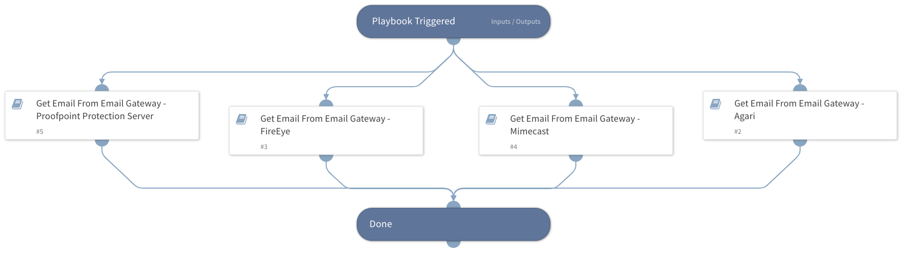

This playbook retrieves a specified EML/MSG file directly from the email security gateway product.

## Dependencies

This playbook uses the following sub-playbooks, integrations, and scripts.

### Sub-playbooks

* Get Email From Email Gateway - FireEye
* Get Email From Email Gateway - Proofpoint Protection Server
* Get Email From Email Gateway - Mimecast

### Integrations

This playbook does not use any integrations.

### Scripts

This playbook does not use any scripts.

### Commands

This playbook does not use any commands.

## Playbook Inputs

---

| **Name** | **Description** | **Default Value** | **Required** |
| --- | --- | --- | --- |
| MessageID | The message ID received by the email security product. |  | Optional |

## Playbook Outputs

---

| **Path** | **Description** | **Type** |
| --- | --- | --- |
| File | The MSG/EML File Entry ID. | string |

## Playbook Image

---

