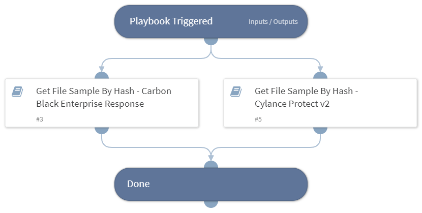

Deprecated. Use `Get File Sample By Hash - Generic v3` instead. This playbook returns a file sample correlating to a hash in the war-room using the following sub-playbooks:
- Get File Sample By Hash - Carbon Black Enterprise Response
- Get File Sample By Hash - Cylance Protect v2

## Dependencies

This playbook uses the following sub-playbooks, integrations, and scripts.

### Sub-playbooks

* Get File Sample By Hash - Cylance Protect v2
* Get File Sample By Hash - Carbon Black Enterprise Response

### Integrations

This playbook does not use any integrations.

### Scripts

This playbook does not use any scripts.

### Commands

This playbook does not use any commands.

## Playbook Inputs

---

| **Name** | **Description** | **Default Value** | **Required** |
| --- | --- | --- | --- |
| MD5 | Get file sample from MD5 input | File.MD5 | Optional |
| SHA256 | Get file sample from SHA256 input | File.SHA256 | Optional |

## Playbook Outputs

---

| **Path** | **Description** | **Type** |
| --- | --- | --- |
| File | File sample object | unknown |

## Playbook Image

---

