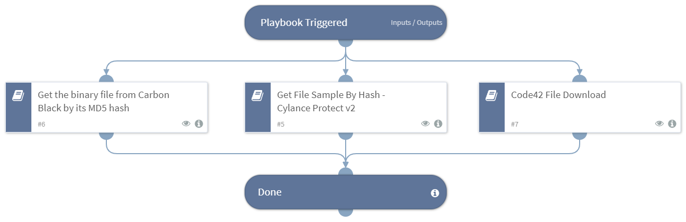

This playbook returns a file sample correlating to a hash in the War Room using the following sub-playbooks:
- Get binary file by MD5 hash from Carbon Black telemetry data - VMware Carbon Black EDR v2.
- Get the threat (file) associated with a specific SHA256 hash - Cylance Protect v2.
- Get the file associated with a specific MD5 or SHA256 hash - Code42.

## Dependencies

This playbook uses the following sub-playbooks, integrations, and scripts.

### Sub-playbooks

* Get the binary file from Carbon Black by its MD5 hash
* Code42 File Download
* Get File Sample By Hash - Cylance Protect v2

### Integrations

This playbook does not use any integrations.

### Scripts

This playbook does not use any scripts.

### Commands

This playbook does not use any commands.

## Playbook Inputs

---

| **Name** | **Description** | **Default Value** | **Required** |
| --- | --- | --- | --- |
| MD5 | The MD5 hash value for the file to retrieve. |  | Optional |
| SHA256 | The SHA256 hash value for the file to retrieve. |  | Optional |
| NewFilename | A new name for the retrieved file. If left empty, the filename will not change. |  | Optional |

## Playbook Outputs

---

| **Path** | **Description** | **Type** |
| --- | --- | --- |
| File.Size | The size of the file. | number |
| File.Type | The type of the file. | string |
| File.Info | General information of the file. | string |
| File.MD5 | The MD5 hash of the file. | string |
| File.SHA1 | The SHA1 hash of the file. | string |
| File.SHA256 | The SHA256 hash of the file. | string |
| File.SHA512 | The SHA512 hash of the file. | string |
| File.SSDeep | The SSDeep of the file. | string |
| File.Extension | The file extension. | string |
| File.EntryID | The file entry ID. | string |
| File.Name | The file name. | string |

## Playbook Image

---

