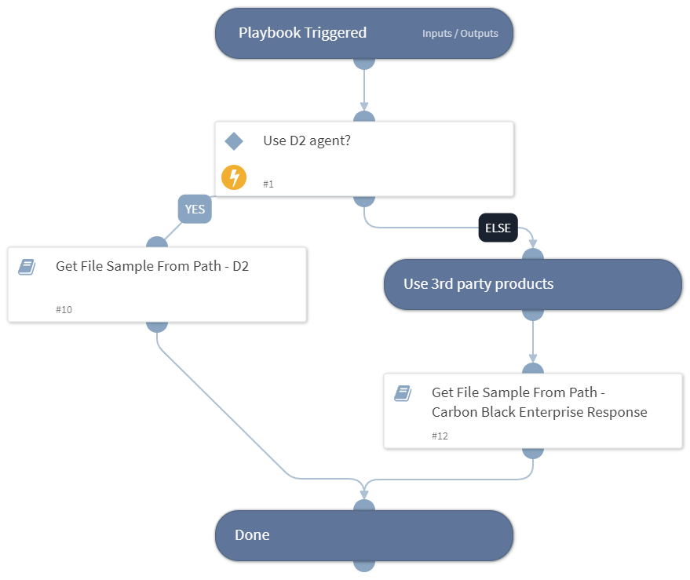

Deprecated. Use `Get File Sample From Path - Generic V3` instead. Returns a file sample to the war-room from a path on an endpoint using one or more integrations

inputs:
* UseD2 - if "True", use Demisto Dissolvable Agent (D2) to return the file (default: False)

## Dependencies

This playbook uses the following sub-playbooks, integrations, and scripts.

### Sub-playbooks

* Get File Sample From Path - Carbon Black Enterprise Response
* Get File Sample From Path - D2

### Integrations

This playbook does not use any integrations.

### Scripts

This playbook does not use any scripts.

### Commands

This playbook does not use any commands.

## Playbook Inputs

---

| **Name** | **Description** | **Default Value** | **Required** |
| --- | --- | --- | --- |
| UseD2 |  | no | Optional |
| Hostname |  | ${Endpoint.Hostname} | Optional |
| Path |  | ${File.Path} | Optional |

## Playbook Outputs

---

| **Path** | **Description** | **Type** |
| --- | --- | --- |
| File | The file to sample. | unknown |

## Playbook Image

---

