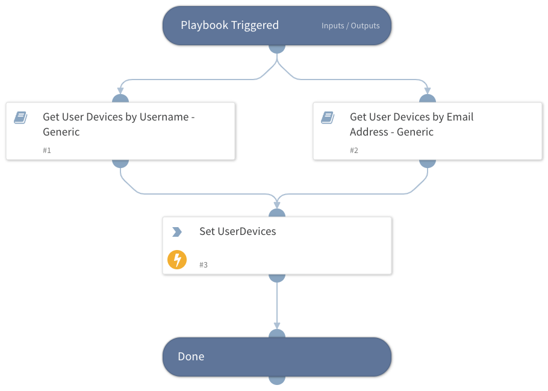

This playbook retrieves information on all of the associated user devices.
In order to get a generic output, the following information on all of the retrieved devices will be saved under the `UserDevices` context key:
- Name
- Serial Number
- ID
- Model
- MAC Address
- OS
- Integration

Note that not all of the supported integrations will be able to retrieve this information.

In order to get the full list of supported integrations, read the following sub-playbooks descriptions:
- Get User Devices by Username - Generic
- Get User Devices by Email Address - Generic

## Dependencies

This playbook uses the following sub-playbooks, integrations, and scripts.

### Sub-playbooks

* Get User Devices by Username - Generic
* Get User Devices by Email Address - Generic

### Integrations

This playbook does not use any integrations.

### Scripts

* SetAndHandleEmpty

### Commands

This playbook does not use any commands.

## Playbook Inputs

---

| **Name** | **Description** | **Default Value** | **Required** |
| --- | --- | --- | --- |
| UserEmail | The email address of the user. |  | Optional |
| Username | The username of the user. |  | Optional |
| GsuiteCustomerID | If Google Workspace, a customer ID is needed. |  | Optional |
| CustomADAttribute | A custom Active Directory attribute. In case there is a custom attribute in Active Directory which stores the name of the computer assigned to the user in the user object, it would be fetched. |  | Optional |

## Playbook Outputs

---

| **Path**                                                              | **Description**                                                                                                                 | **Type** |
|-----------------------------------------------------------------------|---------------------------------------------------------------------------------------------------------------------------------| --- |
| UserDevices                                                           | Devices retrieved by this playbook.                                                                                             | unknown |
| GSuite.MobileDevices.MobileListObjects                                | A list of mobile device objects.                                                                                                | unknown |
| GSuite.MobileDevices.MobileListObjects.kind                           | The type of the API resource.                                                                                                   | unknown |
| GSuite.MobileDevices.MobileListObjects.etag                           | ETag of the resource.                                                                                                           | unknown |
| GSuite.MobileDevices.MobileListObjects.resourceId                     | The unique ID the API service uses to identify the mobile device.                                                               | unknown |
| GSuite.MobileDevices.MobileListObjects.deviceId                       | The serial number for a Google Sync mobile device. For Android and iOS devices, this is a software-generated unique identifier. | unknown |
| GSuite.MobileDevices.MobileListObjects.name                           | A list of the owner's usernames.                                                                                                | unknown |
| GSuite.MobileDevices.MobileListObjects.email                          | A list of the owner's email addresses.                                                                                          | unknown |
| GSuite.MobileDevices.MobileListObjects.model                          | The mobile device's model name.                                                                                                 | unknown |
| GSuite.MobileDevices.MobileListObjects.os                             | The mobile device's operating system.                                                                                           | unknown |
| GSuite.MobileDevices.MobileListObjects.type                           | The type of mobile device.                                                                                                      | unknown |
| GSuite.MobileDevices.MobileListObjects.status                         | The mobile device's status.                                                                                                     | unknown |
| GSuite.MobileDevices.MobileListObjects.hardwareId                     | The IMEI/MEID unique identifier for Android hardware.                                                                           | unknown |
| GSuite.MobileDevices.MobileListObjects.firstSync                      | The date and time the mobile device was initially synchronized with the policy settings in the Admin console.                   | unknown |
| GSuite.MobileDevices.MobileListObjects.lastSync                       | The date and time the mobile device was last synchronized with the policy settings in the Admin console.                        | unknown |
| GSuite.MobileDevices.MobileListObjects.userAgent                      | Information about the mobile device such as the operating system version.                                                       | unknown |
| GSuite.MobileDevices.MobileListObjects.serialNumber                   | The mobile device's serial number.                                                                                              | unknown |
| GSuite.MobileDevices.MobileListObjects.imei                           | The mobile device's IMEI number.                                                                                                | unknown |
| GSuite.MobileDevices.MobileListObjects.meid                           | The mobile device's MEID number.                                                                                                | unknown |
| GSuite.MobileDevices.MobileListObjects.wifiMacAddress                 | The mobile device's MAC address on Wi-Fi networks.                                                                              | unknown |
| GSuite.MobileDevices.MobileListObjects.networkOperator                | Mobile device mobile or network operator.                                                                                       | unknown |
| GSuite.MobileDevices.MobileListObjects.defaultLanguage                | The default locale used on the mobile device.                                                                                   | unknown |
| GSuite.MobileDevices.MobileListObjects.managedAccountIsOnOwnerProfile | Boolean indicating if this account is on the owner/primary profile.                                                             | unknown |
| GSuite.MobileDevices.MobileListObjects.deviceCompromisedStatus        | The compromised device status.                                                                                                  | unknown |
| GSuite.MobileDevices.MobileListObjects.buildNumber                    | The mobile device's operating system build number.                                                                              | unknown |
| GSuite.MobileDevices.MobileListObjects.kernelVersion                  | The mobile device's kernel version.                                                                                             | unknown |
| GSuite.MobileDevices.MobileListObjects.basebandVersion                | The mobile device's baseband version.                                                                                           | unknown |
| GSuite.MobileDevices.MobileListObjects.unknownSourcesStatus           | Unknown sources enabled or disabled on the mobile device.                                                                       | unknown |
| GSuite.MobileDevices.MobileListObjects.adbStatus                      | Whether adb \(USB debugging\) is enabled on the mobile device.                                                                  | unknown |
| GSuite.MobileDevices.MobileListObjects.developerOptionsStatus         | Whether developer options are enabled on the mobile device.                                                                     | unknown |
| GSuite.MobileDevices.MobileListObjects.otherAccountsInfo              | A list of accounts added on the device.                                                                                         | unknown |
| GSuite.MobileDevices.MobileListObjects.supportsWorkProfile            | Work profile supported on the mobile device.                                                                                    | unknown |
| GSuite.MobileDevices.MobileListObjects.manufacturer                   | Mobile device manufacturer.                                                                                                     | unknown |
| GSuite.MobileDevices.MobileListObjects.releaseVersion                 | Mobile device release version.                                                                                                  | unknown |
| GSuite.MobileDevices.MobileListObjects.securityPatchLevel             | Mobile device security patch level.                                                                                             | unknown |
| GSuite.MobileDevices.MobileListObjects.brand                          | Mobile device brand.                                                                                                            | unknown |
| GSuite.MobileDevices.MobileListObjects.bootloaderVersion              | Mobile device bootloader version.                                                                                               | unknown |
| GSuite.MobileDevices.MobileListObjects.hardware                       | Mobile device hardware.                                                                                                         | unknown |
| GSuite.MobileDevices.MobileListObjects.encryptionStatus               | Mobile device encryption status.                                                                                                | unknown |
| GSuite.MobileDevices.MobileListObjects.devicePasswordStatus           | Mobile device password status.                                                                                                  | unknown |
| GSuite.MobileDevices.MobileListObjects.privilege                      | DM agent permission.                                                                                                            | unknown |
| GSuite.MobileDevices.MobileListObjects.applications.packageName       | The application's package name.                                                                                                 | unknown |
| GSuite.MobileDevices.MobileListObjects.applications.displayName       | The application's display name.                                                                                                 | unknown |
| GSuite.MobileDevices.MobileListObjects.applications.versionName       | The application's version name.                                                                                                 | unknown |
| GSuite.MobileDevices.MobileListObjects.applications.versionCode       | The application's version code.                                                                                                 | unknown |
| GSuite.MobileDevices.MobileListObjects.applications.permission        | The list of permissions of this application.                                                                                    | unknown |
| JAMF.Computer                                                         | Jamf computer object.                                                                                                           | unknown |
| JAMF.MobileDevice                                                     | Jamf mobile device object.                                                                                                      | unknown |
| JAMF.Computer.id                                                      | The computer ID.                                                                                                                | unknown |
| JAMF.Computer.name                                                    | The computer name.                                                                                                              | unknown |
| JAMF.Computer.udid                                                    | The computer UDID.                                                                                                              | unknown |
| JAMF.Computer.serial_number                                           | The computer serial number.                                                                                                     | unknown |
| JAMF.Computer.mac_address                                             | The computer MAC address.                                                                                                       | unknown |
| JAMF.Computer.alt_mac_address                                         | The computer alt MAC address.                                                                                                   | unknown |
| JAMF.Computer.asset_tag                                               | The computer asset tag.                                                                                                         | unknown |
| JAMF.Computer.bar_code_1                                              | The computer barcode 1.                                                                                                         | unknown |
| JAMF.Computer.bar_code_2                                              | The computer barcode 2.                                                                                                         | unknown |
| JAMF.Computer.username                                                | The computer username.                                                                                                          | unknown |
| JAMF.Computer.realname                                                | The computer real name.                                                                                                         | unknown |
| JAMF.Computer.email                                                   | The computer email address.                                                                                                     | unknown |
| JAMF.Computer.email_address                                           | The computer email address.                                                                                                     | unknown |
| JAMF.Computer.room                                                    | The computer room.                                                                                                              | unknown |
| JAMF.Computer.position                                                | The computer position.                                                                                                          | unknown |
| JAMF.Computer.building                                                | The computer building.                                                                                                          | unknown |
| JAMF.Computer.building_name                                           | The computer building name.                                                                                                     | unknown |
| JAMF.Computer.department                                              | The computer department.                                                                                                        | unknown |
| JAMF.Computer.department_name                                         | The computer department name.                                                                                                   | unknown |
| JAMF.MobileDevice.id                                                  | The mobile device ID.                                                                                                           | unknown |
| JAMF.MobileDevice.name                                                | The mobile device name.                                                                                                         | unknown |
| JAMF.MobileDevice.udid                                                | The mobile device UDID.                                                                                                         | unknown |
| JAMF.MobileDevice.serial_number                                       | The mobile device serial number.                                                                                                | unknown |
| JAMF.MobileDevice.mac_address                                         | The mobile device MAC address.                                                                                                  | unknown |
| JAMF.MobileDevice.wifi_mac_address                                    | The mobile device WI-FI MAC address.                                                                                            | unknown |
| JAMF.MobileDevice.username                                            | The mobile device username.                                                                                                     | unknown |
| JAMF.MobileDevice.realname                                            | The mobile device real name.                                                                                                    | unknown |
| JAMF.MobileDevice.email                                               | The mobile device user email address.                                                                                           | unknown |
| JAMF.MobileDevice.email_address                                       | The mobile device user email address.                                                                                           | unknown |
| JAMF.MobileDevice.room                                                | The mobile device room.                                                                                                         | unknown |
| JAMF.MobileDevice.position                                            | The mobile device position.                                                                                                     | unknown |
| JAMF.MobileDevice.building                                            | The mobile device building.                                                                                                     | unknown |
| JAMF.MobileDevice.building_name                                       | The mobile device building name.                                                                                                | unknown |
| JAMF.MobileDevice.department                                          | The mobile device department.                                                                                                   | unknown |
| JAMF.MobileDevice.department_name                                     | The mobile device department name.                                                                                              | unknown |
| PaloAltoNetworksXDR.Endpoint                                          | Endpoint object.                                                                                                                | unknown |
| PaloAltoNetworksXDR.Endpoint.endpoint_id                              | The endpoint ID.                                                                                                                | unknown |
| PaloAltoNetworksXDR.Endpoint.endpoint_name                            | The endpoint name.                                                                                                              | unknown |
| PaloAltoNetworksXDR.Endpoint.endpoint_type                            | The endpoint type.                                                                                                              | unknown |
| PaloAltoNetworksXDR.Endpoint.endpoint_status                          | The status of the endpoint.                                                                                                     | unknown |
| PaloAltoNetworksXDR.Endpoint.os_type                                  | The endpoint OS type.                                                                                                           | unknown |
| PaloAltoNetworksXDR.Endpoint.ip                                       | A list of IP addresses.                                                                                                         | unknown |
| PaloAltoNetworksXDR.Endpoint.users                                    | A list of users.                                                                                                                | unknown |
| PaloAltoNetworksXDR.Endpoint.domain                                   | The endpoint domain.                                                                                                            | unknown |
| PaloAltoNetworksXDR.Endpoint.alias                                    | The endpoint's aliases.                                                                                                         | unknown |
| PaloAltoNetworksXDR.Endpoint.first_seen                               | First seen date/time in Epoch \(milliseconds\).                                                                                 | unknown |
| PaloAltoNetworksXDR.Endpoint.last_seen                                | Last seen date/time in Epoch \(milliseconds\).                                                                                  | unknown |
| PaloAltoNetworksXDR.Endpoint.content_version                          | Content version.                                                                                                                | unknown |
| PaloAltoNetworksXDR.Endpoint.installation_package                     | Installation package.                                                                                                           | unknown |
| PaloAltoNetworksXDR.Endpoint.active_directory                         | Active directory.                                                                                                               | unknown |
| PaloAltoNetworksXDR.Endpoint.install_date                             | Install date in Epoch \(milliseconds\).                                                                                         | unknown |
| PaloAltoNetworksXDR.Endpoint.endpoint_version                         | Endpoint version.                                                                                                               | unknown |
| PaloAltoNetworksXDR.Endpoint.is_isolated                              | Whether the endpoint is isolated.                                                                                               | unknown |
| PaloAltoNetworksXDR.Endpoint.group_name                               | The name of the group to which the endpoint belongs.                                                                            | unknown |
| PaloAltoNetworksXDR.Endpoint.count                                    | Number of endpoints returned.                                                                                                   | unknown |
| Endpoint.Hostname                                                     | The hostname that is mapped to this endpoint.                                                                                   | unknown |
| Endpoint.ID                                                           | The unique ID within the tool retrieving the endpoint.                                                                          | unknown |
| Endpoint.IPAddress                                                    | The IP address of the endpoint.                                                                                                 | unknown |
| Endpoint.Domain                                                       | The domain of the endpoint.                                                                                                     | unknown |
| Endpoint.OS                                                           | The endpoint's operation system.                                                                                                | unknown |
| Endpoint.Status                                                       | The endpoint's status.                                                                                                          | unknown |
| Endpoint.IsIsolated                                                   | The endpoint's isolation status.                                                                                                | unknown |
| Endpoint.MACAddress                                                   | The endpoint's MAC address.                                                                                                     | unknown |
| Endpoint.Vendor                                                       | The integration name of the endpoint vendor.                                                                                    | unknown |
| MicrosoftATP.UserMachine.Username                                     | The username.                                                                                                                   | unknown |
| MicrosoftATP.UserMachine.Machines                                     | User machines.                                                                                                                  | unknown |
| MicrosoftATP.UserMachine.Machines.ID                                  | The machine ID.                                                                                                                 | unknown |
| MicrosoftATP.UserMachine.Machines.ComputerDNSName                     | The machine DNS name.                                                                                                           | unknown |
| MicrosoftATP.UserMachine.Machines.FirstSeen                           | The first date and time the machine was observed by Microsoft Defender ATP.                                                     | unknown |
| MicrosoftATP.UserMachine.Machines.OSPlatform                          | The operating system platform.                                                                                                  | unknown |
| MicrosoftATP.UserMachine.Machines.OSVersion                           | The operating system version.                                                                                                   | unknown |
| MicrosoftATP.UserMachine.Machines.OSProcessor                         | The operating system processor.                                                                                                 | unknown |
| MicrosoftATP.UserMachine.Machines.LastExternalIPAddress               | The last IP through which the machine accessed the internet.                                                                    | unknown |
| MicrosoftATP.UserMachine.Machines.OSBuild                             | The operating system build number.                                                                                              | unknown |
| MicrosoftATP.UserMachine.Machines.HealthStatus                        | The machine health status.                                                                                                      | unknown |
| MicrosoftATP.UserMachine.Machines.RBACGroupID                         | The machine RBAC group ID.                                                                                                      | unknown |
| MicrosoftATP.UserMachine.Machines.RBACGroupName                       | The machine RBAC group name.                                                                                                    | unknown |
| MicrosoftATP.UserMachine.Machines.RiskScore                           | The machine risk score.                                                                                                         | unknown |
| MicrosoftATP.UserMachine.Machines.ExposureLevel                       | The machine exposure level.                                                                                                     | unknown |
| MicrosoftATP.UserMachine.Machines.IsAADJoined                         | True if machine is AAD joined, False otherwise.                                                                                 | unknown |
| MicrosoftATP.UserMachine.Machines.AADDeviceID                         | The AAD device ID.                                                                                                              | unknown |
| MicrosoftATP.UserMachine.Machines.MachineTags                         | Set of machine tags.                                                                                                            | unknown |
| MicrosoftATP.v.Machines.LastIPAddress                                 | The last IP on the machine.                                                                                                     | unknown |
| ServiceNow.Computer                                                   | Computer object.                                                                                                                | unknown |
| ServiceNow.Computer.ID                                                | Computer system ID.                                                                                                             | unknown |
| ServiceNow.Computer.AssetTag                                          | Computer asset tag.                                                                                                             | unknown |
| ServiceNow.Computer.Name                                              | Computer name.                                                                                                                  | unknown |
| ServiceNow.Computer.DisplayName                                       | Computer display name.                                                                                                          | unknown |
| ServiceNow.Computer.SupportGroup                                      | Computer support group.                                                                                                         | unknown |
| ServiceNow.Computer.OperatingSystem                                   | Computer operating system.                                                                                                      | unknown |
| ServiceNow.Computer.Company                                           | Computer company system ID.                                                                                                     | unknown |
| ServiceNow.Computer.AssignedTo                                        | Computer assigned to user system ID.                                                                                            | unknown |
| ServiceNow.Computer.State                                             | Computer state.                                                                                                                 | unknown |
| ServiceNow.Computer.Cost                                              | Computer cost.                                                                                                                  | unknown |
| ServiceNow.Computer.Comments                                          | Computer comments.                                                                                                              | unknown |
| UserDevices.Name                                                      | Devices names retrieved by this playbook.                                                                                       | unknown |
| UserDevices.SerialNumber                                              | Devices serial numbers retrieved by this playbook.                                                                              | unknown |
| UserDevices.ID                                                        | Devices IDs retrieved by this playbook.                                                                                         | unknown |
| UserDevices.Model                                                     | Devices models retrieved by this playbook.                                                                                      | unknown |
| UserDevices.OS                                                        | Devices operating systems retrieved by this playbook.                                                                           | unknown |
| UserDevices.Integration                                               | The integration which retrieved the devices.                                                                                    | unknown |
| UserDevices.MACAddress                                                | Devices MAC Address retrieved by this playbook.                                                                                 | unknown |
| MicrosoftGraph.profileType                                            | Device profile type.                                                                                                            | unknown |
| MicrosoftGraph.operatingSystemVersion                                 | Device OS version.                                                                                                              | unknown |
| MicrosoftGraph.displayName                                            | Device display name.                                                                                                            | unknown |
| MicrosoftGraph.operatingSystem                                        | Device OS.                                                                                                                      | unknown |
| MicrosoftGraph.deviceId                                               | Device ID.                                                                                                                      | unknown |

## Playbook Image

---

