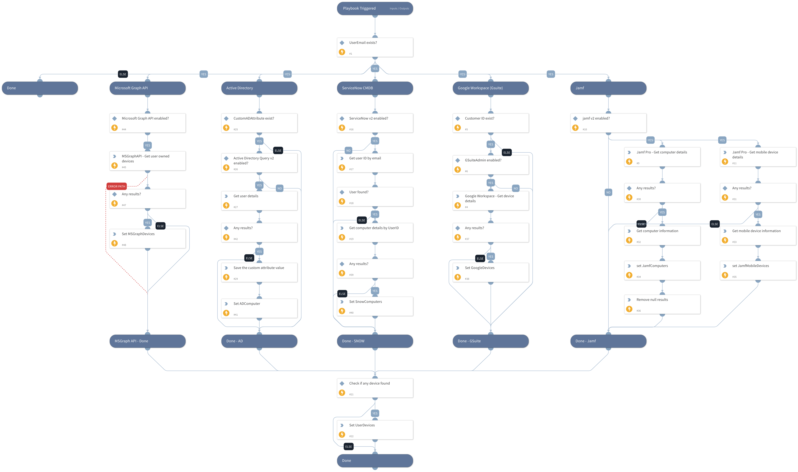

This playbook retrieves information on all of the associated user devices, based on the user email.
In order to get a generic output, the following information on all of the retrieved devices will be saved under the `UserDevices` context key:
- Name
- Serial Number
- ID
- Model
- MAC Address
- OS
- Integration

Note that not all of the supported integrations will be able to retrieve this information.

Supported integrations:
- jamf v2
- Google Workspace (Gsuite)
- ServiceNow v2
- Active Directory Query v2
- Microsoft Graph API (In order to get devices details, provide the permissions as mentioned here: https://learn.microsoft.com/en-us/graph/api/user-list-owneddevices?view=graph-rest-1.0&tabs=http )

## Dependencies

This playbook uses the following sub-playbooks, integrations, and scripts.

### Sub-playbooks

This playbook does not use any sub-playbooks.

### Integrations

* Microsoft Graph API
* jamf v2
* ServiceNow v2

### Scripts

* IsIntegrationAvailable
* SetMultipleValues
* SetAndHandleEmpty

### Commands

* ad-get-user
* servicenow-query-users
* gsuite-mobiledevice-list
* jamf-get-mobile-device-by-id
* jamf-get-computer-by-match
* jamf-get-mobile-device-by-match
* msgraph-api-request
* jamf-get-computer-by-id
* servicenow-query-computers

## Playbook Inputs

---

| **Name** | **Description** | **Default Value** | **Required** |
| --- | --- | --- | --- |
| UserEmail | The email address of the user. |  | Optional |
| GsuiteCustomerID | If using Google Workspace, a customer ID is needed. |  | Optional |
| CustomADAttribute | A custom Active Directory attribute. In case there is a custom attribute in Active Directory which stores the name of the computer assigned to the user in the user object, it would be fetched. |  | Optional |

## Playbook Outputs

---

| **Path**                                                             | **Description**                                                                                                                 | **Type** |
|----------------------------------------------------------------------|---------------------------------------------------------------------------------------------------------------------------------| --- |
| GSuite.MobileDevices                                                 | Gsuite mobile devices.                                                                                                          | unknown |
| GSuite.MobileDevices.MobileListObjects                               | A list of mobile device objects.                                                                                                | unknown |
| GSuite.MobileDevices.MobileListObjects.kind                          | The type of the API resource.                                                                                                   | unknown |
| GSuite.MobileDevices.MobileListObjects.etag                          | ETag of the resource.                                                                                                           | unknown |
| GSuite.MobileDevices.MobileListObjects.resourceId                    | The unique ID the API service uses to identify the mobile device.                                                               | unknown |
| GSuite.MobileDevices.MobileListObjects.deviceId                      | The serial number for a Google Sync mobile device. For Android and iOS devices, this is a software-generated unique identifier. | unknown |
| GSuite.MobileDevices.MobileListObjects.name                          | A list of the owner's usernames.                                                                                                | unknown |
| GSuite.MobileDevices.MobileListObjects.email                         | A list of the owner's email addresses.                                                                                          | unknown |
| GSuite.MobileDevices.MobileListObjects.model                         | The mobile device's model name.                                                                                                 | unknown |
| GSuite.MobileDevices.MobileListObjects.os                            | The mobile device's operating system.                                                                                           | unknown |
| GSuite.MobileDevices.MobileListObjects.type                          | The type of mobile device.                                                                                                      | unknown |
| GSuite.MobileDevices.MobileListObjects.status                        | The mobile device's status.                                                                                                     | unknown |
| GSuite.MobileDevices.MobileListObjects.hardwareId                    | The IMEI/MEID unique identifier for Android hardware.                                                                           | unknown |
| GSuite.MobileDevices.MobileListObjects.firstSync                     | The date and time the mobile device was initially synchronized with the policy settings in the Admin console.                   | unknown |
| GSuite.MobileDevices.MobileListObjects.lastSync                      | The date and time the mobile device was last synchronized with the policy settings in the Admin console.                        | unknown |
| GSuite.MobileDevices.MobileListObjects.userAgent                     | Information about the mobile device such as the operating system version.                                                       | unknown |
| GSuite.MobileDevices.MobileListObjects.serialNumber                  | The mobile device's serial number.                                                                                              | unknown |
| GSuite.MobileDevices.MobileListObjects.imei                          | The mobile device's IMEI number.                                                                                                | unknown |
| GSuite.MobileDevices.MobileListObjects.meid                          | The mobile device's MEID number.                                                                                                | unknown |
| GSuite.MobileDevices.MobileListObjects.wifiMacAddress                | The mobile device's MAC address on Wi-Fi networks.                                                                              | unknown |
| GSuite.MobileDevices.MobileListObjects.networkOperator               | Mobile device mobile or network operator.                                                                                       | unknown |
| GSuite.MobileDevices.MobileListObjects.defaultLanguage               | The default locale used on the mobile device.                                                                                   | unknown |
| GSuite.MobileDevices.MobileListObjects.managedAccountIsOnOwnerProfile | Boolean indicating if this account is on the owner/primary profile.                                                             | unknown |
| GSuite.MobileDevices.MobileListObjects.deviceCompromisedStatus       | The compromised device status.                                                                                                  | unknown |
| GSuite.MobileDevices.MobileListObjects.buildNumber                   | The mobile device's operating system build number.                                                                              | unknown |
| GSuite.MobileDevices.MobileListObjects.kernelVersion                 | The mobile device's kernel version.                                                                                             | unknown |
| GSuite.MobileDevices.MobileListObjects.basebandVersion               | The mobile device's baseband version.                                                                                           | unknown |
| GSuite.MobileDevices.MobileListObjects.unknownSourcesStatus          | Unknown sources enabled or disabled on the mobile device.                                                                       | unknown |
| GSuite.MobileDevices.MobileListObjects.adbStatus                     | Whether adb \(USB debugging\) is enabled on the mobile device.                                                                  | unknown |
| GSuite.MobileDevices.MobileListObjects.developerOptionsStatus        | Whether developer options are enabled on the mobile device.                                                                     | unknown |
| GSuite.MobileDevices.MobileListObjects.otherAccountsInfo             | A list of accounts added on the device.                                                                                         | unknown |
| GSuite.MobileDevices.MobileListObjects.supportsWorkProfile           | Work profile supported on the mobile device.                                                                                    | unknown |
| GSuite.MobileDevices.MobileListObjects.manufacturer                  | Mobile device manufacturer.                                                                                                     | unknown |
| GSuite.MobileDevices.MobileListObjects.releaseVersion                | Mobile device release version.                                                                                                  | unknown |
| GSuite.MobileDevices.MobileListObjects.securityPatchLevel            | Mobile device security patch level.                                                                                             | unknown |
| GSuite.MobileDevices.MobileListObjects.brand                         | Mobile device brand.                                                                                                            | unknown |
| GSuite.MobileDevices.MobileListObjects.bootloaderVersion             | Mobile device bootloader version.                                                                                               | unknown |
| GSuite.MobileDevices.MobileListObjects.hardware                      | Mobile device hardware.                                                                                                         | unknown |
| GSuite.MobileDevices.MobileListObjects.encryptionStatus              | Mobile device encryption status.                                                                                                | unknown |
| GSuite.MobileDevices.MobileListObjects.devicePasswordStatus          | Mobile device password status.                                                                                                  | unknown |
| GSuite.MobileDevices.MobileListObjects.privilege                     | DM agent permission.                                                                                                            | unknown |
| GSuite.MobileDevices.MobileListObjects.applications                  | GSuite mobile device applications.                                                                                              | unknown |
| GSuite.MobileDevices.MobileListObjects.applications.packageName      | The application's package name.                                                                                                 | unknown |
| GSuite.MobileDevices.MobileListObjects.applications.displayName      | The application's display name.                                                                                                 | unknown |
| GSuite.MobileDevices.MobileListObjects.applications.versionName      | The application's version name.                                                                                                 | unknown |
| GSuite.MobileDevices.MobileListObjects.applications.versionCode      | The application's version code.                                                                                                 | unknown |
| GSuite.MobileDevices.MobileListObjects.applications.permission       | The list of permissions of this application.                                                                                    | unknown |
| JAMF.Computer                                                        | Jamf computer object.                                                                                                           | unknown |
| JAMF.Computer.id                                                     | The computer ID.                                                                                                                | unknown |
| JAMF.Computer.name                                                   | The computer name.                                                                                                              | unknown |
| JAMF.Computer.udid                                                   | The computer UDID.                                                                                                              | unknown |
| JAMF.Computer.serial_number                                          | The computer serial number.                                                                                                     | unknown |
| JAMF.Computer.mac_address                                            | The computer MAC address.                                                                                                       | unknown |
| JAMF.Computer.alt_mac_address                                        | The computer alt MAC address.                                                                                                   | unknown |
| JAMF.Computer.asset_tag                                              | The computer asset tag.                                                                                                         | unknown |
| JAMF.Computer.bar_code_1                                             | The computer barcode 1.                                                                                                         | unknown |
| JAMF.Computer.bar_code_2                                             | The computer barcode 2.                                                                                                         | unknown |
| JAMF.Computer.username                                               | The computer username.                                                                                                          | unknown |
| JAMF.Computer.realname                                               | The computer real name.                                                                                                         | unknown |
| JAMF.Computer.email                                                  | The computer email address.                                                                                                     | unknown |
| JAMF.Computer.email_address                                          | The computer email address.                                                                                                     | unknown |
| JAMF.Computer.room                                                   | The computer room.                                                                                                              | unknown |
| JAMF.Computer.position                                               | The computer position.                                                                                                          | unknown |
| JAMF.Computer.building                                               | The computer building.                                                                                                          | unknown |
| JAMF.Computer.building_name                                          | The computer building name.                                                                                                     | unknown |
| JAMF.Computer.department                                             | The computer department.                                                                                                        | unknown |
| JAMF.Computer.department_name                                        | The computer department name.                                                                                                   | unknown |
| JAMF.MobileDevice                                                    | Jamf mobile device object.                                                                                                      | unknown |
| JAMF.MobileDevice.id                                                 | The mobile device ID.                                                                                                           | unknown |
| JAMF.MobileDevice.name                                               | The mobile device name.                                                                                                         | unknown |
| JAMF.MobileDevice.udid                                               | The mobile device UDID.                                                                                                         | unknown |
| JAMF.MobileDevice.serial_number                                      | The mobile device serial number.                                                                                                | unknown |
| JAMF.MobileDevice.mac_address                                        | The mobile device MAC address.                                                                                                  | unknown |
| JAMF.MobileDevice.wifi_mac_address                                   | The mobile device WI-FI MAC address.                                                                                            | unknown |
| JAMF.MobileDevice.username                                           | The mobile device username.                                                                                                     | unknown |
| JAMF.MobileDevice.realname                                           | The mobile device real name.                                                                                                    | unknown |
| JAMF.MobileDevice.email                                              | The mobile device user email address.                                                                                           | unknown |
| JAMF.MobileDevice.email_address                                      | The mobile device user email address.                                                                                           | unknown |
| JAMF.MobileDevice.room                                               | The mobile device room.                                                                                                         | unknown |
| JAMF.MobileDevice.position                                           | The mobile device position.                                                                                                     | unknown |
| JAMF.MobileDevice.building                                           | The mobile device building.                                                                                                     | unknown |
| JAMF.MobileDevice.building_name                                      | The mobile device building name.                                                                                                | unknown |
| JAMF.MobileDevice.department                                         | The mobile device department.                                                                                                   | unknown |
| JAMF.MobileDevice.department_name                                    | The mobile device department name.                                                                                              | unknown |
| ServiceNow.Computer                                                  | ServiceNow computer object.                                                                                                     | unknown |
| ServiceNow.Computer.ID                                               | Computer system ID.                                                                                                             | unknown |
| ServiceNow.Computer.AssetTag                                         | Computer asset tag.                                                                                                             | unknown |
| ServiceNow.Computer.Name                                             | Computer name.                                                                                                                  | unknown |
| ServiceNow.Computer.DisplayName                                      | Computer display name.                                                                                                          | unknown |
| ServiceNow.Computer.SupportGroup                                     | Computer support group.                                                                                                         | unknown |
| ServiceNow.Computer.OperatingSystem                                  | Computer operating system.                                                                                                      | unknown |
| ServiceNow.Computer.Company                                          | Computer company system ID.                                                                                                     | unknown |
| ServiceNow.Computer.AssignedTo                                       | Computer assigned to user system ID.                                                                                            | unknown |
| ServiceNow.Computer.State                                            | Computer state.                                                                                                                 | unknown |
| ServiceNow.Computer.Cost                                             | Computer cost.                                                                                                                  | unknown |
| ServiceNow.Computer.Comments                                         | Computer comments.                                                                                                              | unknown |
| UserDevices                                                          | Devices retrieved by this playbook.                                                                                             | unknown |
| UserDevices.Name                                                     | Devices names retrieved by this playbook.                                                                                       | unknown |
| UserDevices.SerialNumber                                             | Devices serial numbers retrieved by this playbook.                                                                              | unknown |
| UserDevices.ID                                                       | Devices IDs retrieved by this playbook.                                                                                         | unknown |
| UserDevices.Model                                                    | Devices models retrieved by this playbook.                                                                                      | unknown |
| UserDevices.OS                                                       | Devices operating systems retrieved by this playbook.                                                                           | unknown |
| UserDevices.Integration                                              | The integration which retrieved the devices.                                                                                    | unknown |
| UserDevices.MACAddress                                               | Devices MAC Address retrieved by this playbook.                                                                                 | unknown |
| MicrosoftGraph                                                       | MicrosoftGraph results.                                                                                                         | unknown |
| MicrosoftGraph.profileType                                           | Device profile type.                                                                                                            | unknown |
| MicrosoftGraph.operatingSystemVersion                                | Device OS version.                                                                                                              | unknown |
| MicrosoftGraph.displayName                                           | Device display name.                                                                                                            | unknown |
| MicrosoftGraph.operatingSystem                                       | Device OS.                                                                                                                      | unknown |
| MicrosoftGraph.deviceId                                              | Device ID.                                                                                                                      | unknown |

## Playbook Image

---

