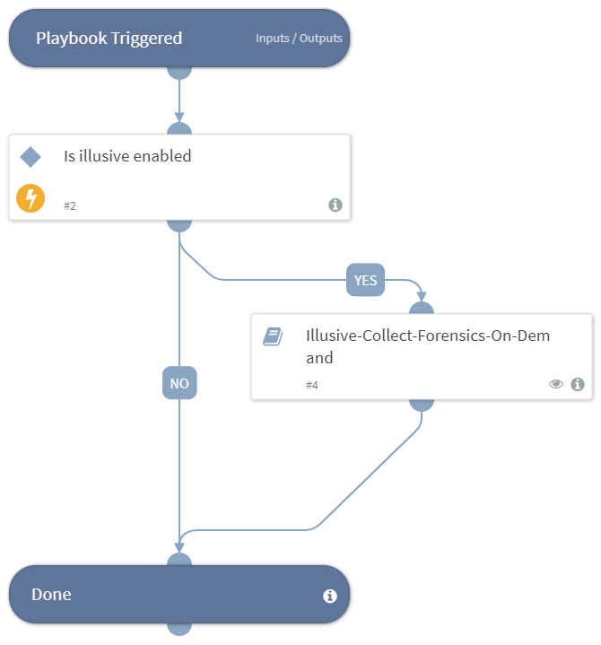

This playbook retrieves forensics from hosts for the following integrations:
- Illusive Networks 
- Microsoft Defender For Endpoint

## Dependencies
This playbook uses the following sub-playbooks, integrations, and scripts.

### Sub-playbooks
* Illusive-Collect-Forensics-On-Demand
* Microsoft Defender For Endpoint - Collect investigation package

### Integrations
This playbook does not use any integrations.

### Scripts
IsIntegrationAvailable

### Commands
This playbook does not use any commands.

## Playbook Inputs
---

| **Name** | **Description** | **Default Value** | **Required** |
| --- | --- | --- | --- |
| fqdn_or_ip | If using the Illusive Networks integration to retrieve additional forensics, provide the host fqdn_or_ip from which to get the forensics.  |  | Optional |
| start_date | Date_range must be "number date_range_unit", for example 2 hours, 4 minutes, 6 months, 1 day. |  | Optional |
| end_date | Date_range must be "number date_range_unit" for example 2 hours, 4 minutes, 6 months, 1 day. |  | Optional |
| machine_ID | The machine IDs of the systems you want to retrieve. |  | Optional |

## Playbook Outputs
---
There are no outputs for this playbook.

## Playbook Image
---

