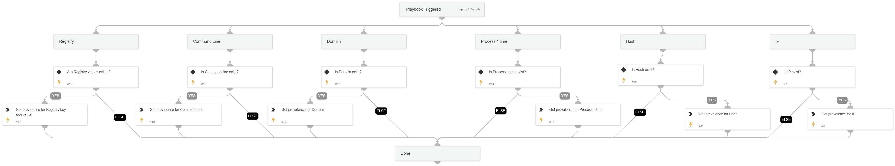

The playbook queries the analytics module to receive the prevalence of an IOC.

Supported IOCs:
- Process by SHA256
- Process by file name
- IP
- Domain
- CMD
- Registry (require key and value)

## Dependencies
This playbook uses the following sub-playbooks, integrations, and scripts.

### Sub-playbooks
This playbook does not use any sub-playbooks.

### Integrations
This playbook does not use any integrations.

### Scripts
This playbook does not use any scripts.

### Commands
* core-get-domain-analytics-prevalence
* core-get-IP-analytics-prevalence
* core-get-hash-analytics-prevalence
* core-get-registry-analytics-prevalence
* core-get-cmd-analytics-prevalence
* core-get-process-analytics-prevalence

## Playbook Inputs
---

| **Name** | **Description**                                                                            | **Default Value** | **Required** |
| --- |--------------------------------------------------------------------------------------------| --- | --- |
| IP | IP address to run the prevalence check.                                                                 |  | Optional |
| Hash | Hash to run the prevalence check.                                                               |  | Optional |
| Commandline | The CMD to run the prevalence check.                                                           |  | Optional |                                                                                           |  | Optional |
| Process | The process name to run the prevalence check.                                                   |  | Optional |
| RegistryKey | The registry key to run the prevalence check. The input registry value must be provided as well. |  | Optional |
| RegistryValue | The registry value to run the prevalence check. The input registry key must be provided as well. |  | Optional |
| Domain | The domain to run the prevalence check.                                                         |  | Optional |

## Playbook Outputs
---

| **Path** | **Description** | **Type** |
| --- | --- | --- |
| Core.AnalyticsPrevalence.Ip | Whether the IP address is prevalent or not. | unknown |
| Core.AnalyticsPrevalence.Ip.value | Whether the IP address is prevalent or not. | unknown |
| Core.AnalyticsPrevalence.Ip.data.global_prevalence | The global prevalence of the IP address. | unknown |
| Core.AnalyticsPrevalence.Ip.data.global_prevalence.value | The global prevalence of the IP address. | unknown |
| Core.AnalyticsPrevalence.Ip.data.local_prevalence | The local prevalence of the IP address. | unknown |
| Core.AnalyticsPrevalence.Ip.data.local_prevalence.value | The local prevalence of the IP address. | unknown |
| Core.AnalyticsPrevalence.Ip.data.prevalence | The prevalence of the IP address. | unknown |
| Core.AnalyticsPrevalence.Ip.data.prevalence.value | The prevalence of the IP address. | unknown |
| Core.AnalyticsPrevalence.Hash | The prevalence of the hash. | unknown |
| Core.AnalyticsPrevalence.Hash.value | Whether the hash is prevalent or not. | unknown |
| Core.AnalyticsPrevalence.Hash.data.global_prevalence | The prevalence of the hash. | unknown |
| Core.AnalyticsPrevalence.Hash.data.global_prevalence.value | The global prevalence of the hash. | unknown |
| Core.AnalyticsPrevalence.Hash.data.local_prevalence | The local prevalence of the hash. | unknown |
| Core.AnalyticsPrevalence.Hash.data.local_prevalence.value | The local prevalence of the hash. | unknown |
| Core.AnalyticsPrevalence.Hash.data.prevalence | The prevalence of the hash. | unknown |
| Core.AnalyticsPrevalence.Hash.data.prevalence.value | The prevalence of the hash. | unknown |
| Core.AnalyticsPrevalence.Domain | The prevalence of the domain. | unknown |
| Core.AnalyticsPrevalence.Domain.value | Whether the domain is prevalent or not. | unknown |
| Core.AnalyticsPrevalence.Domain.data.global_prevalence | The global prevalence of the domain. | unknown |
| Core.AnalyticsPrevalence.Domain.data.global_prevalence.value | The global prevalence of the domain. | unknown |
| Core.AnalyticsPrevalence.Domain.data.local_prevalence | The local prevalence of the domain. | unknown |
| Core.AnalyticsPrevalence.Domain.data.local_prevalence.value | The local prevalence of the domain. | unknown |
| Core.AnalyticsPrevalence.Domain.data.prevalence | The prevalence of the domain. | unknown |
| Core.AnalyticsPrevalence.Domain.data.prevalence.value | The prevalence of the domain. | unknown |
| Core.AnalyticsPrevalence.Process | The prevalence of the process. | unknown |
| Core.AnalyticsPrevalence.Process.value | Whether the process is prevalent or not. | unknown |
| Core.AnalyticsPrevalence.Process.data.global_prevalence | The global prevalence of the process. | unknown |
| Core.AnalyticsPrevalence.Process.data.global_prevalence.value | The global prevalence of the process. | unknown |
| Core.AnalyticsPrevalence.Process.data.local_prevalence | The local prevalence of the process. | unknown |
| Core.AnalyticsPrevalence.Process.data.local_prevalence.value | The local prevalence of the process. | unknown |
| Core.AnalyticsPrevalence.Process.data.prevalence | The prevalence of the process. | unknown |
| Core.AnalyticsPrevalence.Process.data.prevalence.value | The prevalence of the process. | unknown |
| Core.AnalyticsPrevalence.Registry | The prevalence of the registry. | unknown |
| Core.AnalyticsPrevalence.Registry.value | Whether the registry is prevalent or not. | unknown |
| Core.AnalyticsPrevalence.Registry.data.global_prevalence | The global prevalence of the registry. | unknown |
| Core.AnalyticsPrevalence.Registry.data.global_prevalence.value | The global prevalence of the registry. | unknown |
| Core.AnalyticsPrevalence.Registry.data.local_prevalence | The local  prevalence of the registry. | unknown |
| Core.AnalyticsPrevalence.Registry.data.local_prevalence.value | The local prevalence of the registry. | unknown |
| Core.AnalyticsPrevalence.Registry.data.prevalence | The prevalence of the registry. | unknown |
| Core.AnalyticsPrevalence.Registry.data.prevalence.value | The prevalence of the registry. | unknown |
| Core.AnalyticsPrevalence.Cmd | The prevalence of the CMD. | unknown |
| Core.AnalyticsPrevalence.Cmd.value | Whether the CMD is prevalent or not. | unknown |
| Core.AnalyticsPrevalence.Cmd.data.global_prevalence | The global prevalence of the CMD. | unknown |
| Core.AnalyticsPrevalence.Cmd.data.global_prevalence.value | The global prevalence of the CMD. | unknown |
| Core.AnalyticsPrevalence.Cmd.data.local_prevalence | The local prevalence of the CMD. | unknown |
| Core.AnalyticsPrevalence.Cmd.data.local_prevalence.value | The local prevalence of the CMD. | unknown |
| Core.AnalyticsPrevalence.Cmd.data.prevalence | The prevalence of the CMD. | unknown |
| Core.AnalyticsPrevalence.Cmd.data.prevalence.value | The prevalence of the Cmd. | unknown |

## Playbook Image
---

