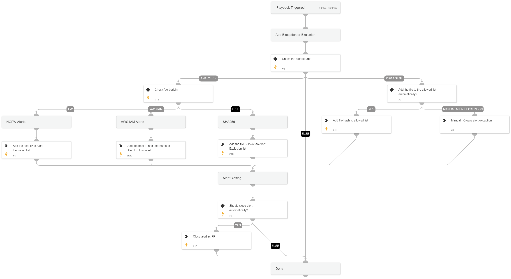

This playbook handles false positive alerts.
It creates an alert exclusion or alert exception, or adds a file to an allow list based on the alert fields and playbook inputs.

## Dependencies
This playbook uses the following sub-playbooks, integrations, and scripts.

### Sub-playbooks
This playbook does not use any sub-playbooks.

### Integrations
This playbook does not use any integrations.

### Scripts
This playbook does not use any scripts.

### Commands
* core-iocs-disable
* core-allowlist-files
* closeInvestigation
* core-add-exclusion

## Playbook Inputs
---

| **Name** | **Description** | **Default Value** | **Required** |
| --- | --- | --- | --- |
| ShouldCloseAutomatically | Should we automatically close false positive alerts? Specify true/false. |  | Optional |
| sourceIP | The host IP from the alert. | alert.hostip | Optional |
| username | The username from the alert. | alert.username | Optional |
| alertName | The alert name. | alert.name | Optional |
| FileSHA256 | The file SHA256 from the alert. | alert.initiatorsha256 | Optional |
| IOC | The IOC to disable from IOC alerts. |  | Optional |
| ShouldHandleFPautomatically | Should we automatically handle false positive alerts? Specify true/false. |  | Optional |

## Playbook Outputs
---
There are no outputs for this playbook.

## Playbook Image
---
