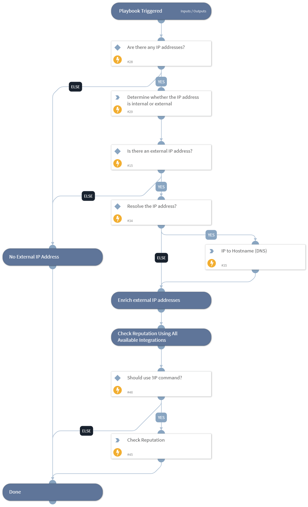

Enrich IP addresses using one or more integrations.

- Resolve IP addresses to hostnames (DNS).
- Provide threat information.
- Separate internal and external addresses.

## Dependencies
This playbook uses the following sub-playbooks, integrations, and scripts.

### Sub-playbooks
This playbook does not use any sub-playbooks.

### Integrations
* VirusTotal - Private API

### Scripts
* IsIPInRanges
* IPToHost

### Commands
* ip
* threat-crowd-ip
* vt-private-get-ip-report

## Playbook Inputs
---

| **Name** | **Description** | **Default Value** | **Required** |
| --- | --- | --- | --- |
| IP | The IP address to enrich. | IP.Address | Optional |
| InternalRange | A CSV list of IP address ranges \(in CIDR notation\). Use this list to check if an IP address is found within a set of IP address ranges. For example: "172.16.0.0/12,10.0.0.0/8,192.168.0.0/16" \(without quotes\). If a list is not provided, will use default list provided in the IsIPInRanges script \(the known IPv4 private address ranges\). | 172.16.0.0/12,10.0.0.0/8,192.168.0.0/16 | Optional |
| ResolveIP | Whether to convert the IP address to a hostname using a DNS query \(True/False\). | True | Required |
| UseReputationCommand | Define if you would like to use the \!IP command. Note: This input should be used whenever there is no auto-extract enabled in the investigation flow. Possible values: True / False. | False | Required |

## Playbook Outputs
---

| **Path** | **Description** | **Type** |
| --- | --- | --- |
| IP | The IP address objects. | unknown |
| DBotScore | Indicator, Score, Type, and Vendor. | unknown |
| Endpoint | The endpoint's object. | unknown |
| Endpoint.Hostname | The hostname to enrich. | string |
| Endpoint.OS | Endpoint operating system. | string |
| Endpoint.IP | A list of endpoint IP addresses. | unknown |
| Endpoint.MAC | A list of endpoint MAC addresses. | unknown |
| Endpoint.Domain | Endpoint domain name. | string |

## Playbook Image
---
