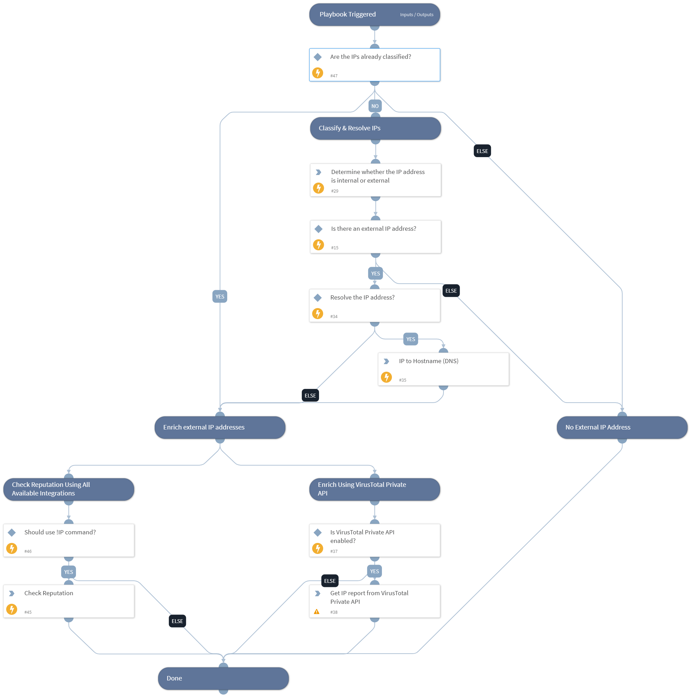

Enrich IP addresses using one or more integrations.

- Resolve IP addresses to hostnames (DNS).
- Provide threat information.
- IP address reputation using !ip command.
- Separate internal and external addresses.

## Dependencies

This playbook uses the following sub-playbooks, integrations, and scripts.

### Sub-playbooks

This playbook does not use any sub-playbooks.

### Integrations

* VirusTotal - Private API

### Scripts

* IPToHost
* IsIPInRanges

### Commands

* vt-private-get-ip-report
* ip

## Playbook Inputs

---

| **Name** | **Description** | **Default Value** | **Required** |
| --- | --- | --- | --- |
| IP | The IP address to enrich. | IP.Address | Optional |
| InternalRange | A comma-separated list of IP address ranges \(in CIDR notation\). Use this list to check if an IP address is found within a set of IP address ranges. For example: "172.16.0.0/12,10.0.0.0/8,192.168.0.0/16" \(without quotes\). | lists.PrivateIPs | Optional |
| ResolveIP | Whether to convert the IP address to a hostname using a DNS query \(True/False\). The default value is true. | True | Required |
| UseReputationCommand | Define if you would like to use the \!IP command. Note: This input should be used whenever there is no auto-extract enabled in the investigation flow. Possible values: True / False. The default value is false. | False | Required |
| extended_data | Define whether you want the generic reputation command to return extended data \(last_analysis_results\). Possible values: True / False. The default value is false. | False | Optional |
| threat_model_association | Define whether you wish to enhance generic reputation command to include additional information such as Threat Bulletins, Attack patterns, Actors, Campaigns, TTPs, vulnerabilities, etc. Note: If set to true, additional 6 API calls will be performed. Possible values: True / False. The default value is false. | False | Optional |
| ExecutedFromParent | Whether to execute common logic, like the classification of IP addresses to ranges and resolving, in the the main \(IP Enrichment - Generic v2\) enrichment playbook, instead of the sub-playbooks. Possible values are: True, False.  Setting this to True and using the parent playbook will execute the relevant commands in the main playbook instead of executing them in both sub-playbooks, which improves the performance of the playbook and reducing the overall size of the incident. | False | Optional |

## Playbook Outputs

---

| **Path** | **Description** | **Type** |
| --- | --- | --- |
| IP | The IP address objects. | unknown |
| DBotScore | Indicator, Score, Type, and Vendor. | unknown |
| Endpoint | The endpoint's object. | unknown |
| Endpoint.Hostname | The hostname to enrich. | string |
| Endpoint.IP | A list of endpoint IP addresses. | string |
| IP.Address | The IP Address. | string |
| IP.InRange | Is the IP in the input ranges? \(could be 'yes' or 'no\). | string |
| DBotScore.Indicator | The indicator that was tested. | string |
| DBotScore.Type | The indicator type. | string |
| DBotScore.Vendor | The vendor used to calculate the score. | string |
| DBotScore.Score | The actual score. | string |
| IP.ASN | The Autonomous System \(AS\) number associated with the indicator. | string |
| IP.Tags | List of IP tags. | string |
| IP.ThreatTypes | Threat types associated with the IP. | string |
| IP.Geo.Country | The country associated with the indicator. | string |
| IP.Geo.Location | The longitude and latitude of the IP address. | string |
| IP.Malicious.Vendor | The vendor that reported the indicator as malicious. | string |
| IP.Malicious.Description | For malicious IPs, the reason that the vendor made the decision. | string |
| IP.VirusTotal.DownloadedHashes | Latest files that are detected by at least one antivirus solution and were downloaded by VirusTotal from the IP address. | string |
| IP.VirusTotal.UnAVDetectedDownloadedHashes | Latest files that are not detected by any antivirus solution and were downloaded by VirusTotal from the IP address provided. | string |
| IP.VirusTotal.DetectedURLs | Latest URLs hosted in this IP address detected by at least one URL scanner. | string |
| IP.VirusTotal.CommunicatingHashes | Latest detected files that communicate with this IP address. | string |
| IP.VirusTotal.UnAVDetectedCommunicatingHashes | Latest undetected files that communicate with this IP address. | string |
| IP.VirusTotal.Resolutions.hostname | The following domains resolved to the given IP. | string |
| IP.VirusTotal.ReferrerHashes | Latest detected files that embed this IP address in their strings. | string |
| IP.VirusTotal.UnAVDetectedReferrerHashes | Latest undetected files that embed this IP address in their strings. | string |
| IP.VirusTotal.Resolutions.last_resolved | The last time the following domains resolved to the given IP. | string |

## Playbook Image

---

