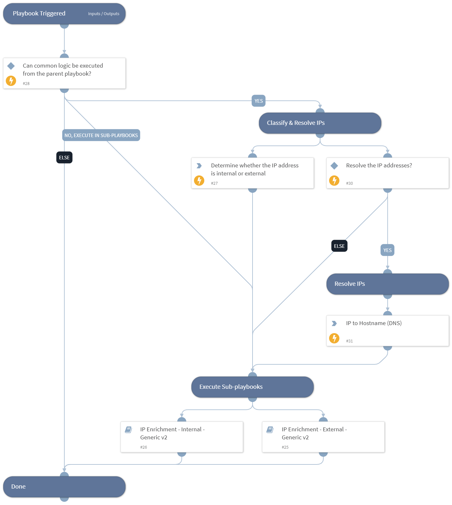

Enrich IP addresses using one or more integrations.

- Resolve IP addresses to hostnames (DNS)
- Provide threat information
- Separate internal and external IP addresses
- For internal IP addresses, get host information

## Dependencies
This playbook uses the following sub-playbooks, integrations, and scripts.

### Sub-playbooks
* IP Enrichment - Internal - Generic v2
* IP Enrichment - External - Generic v2

### Integrations
This playbook does not use any integrations.

### Scripts
This playbook does not use any scripts.

### Commands
This playbook does not use any commands.

## Playbook Inputs
---

| **Name** | **Description** | **Default Value** | **Required** |
| --- | --- | --- | --- |
| IP | The IP address to enrich. | IP.Address | Optional |
| InternalRange | A list of internal IP ranges to check IP addresses against. The list should be provided in CIDR notation, separated by commas. An example of a list of ranges would be: "172.16.0.0/12,10.0.0.0/8,192.168.0.0/16" \(without quotes\). If a list is not provided, will use default list provided in the IsIPInRanges script \(the known IPv4 private address ranges\). | inputs.InternalRange | Optional |
| ResolveIP | Determines whether to convert the IP address to a hostname using a DNS query \(True/ False\). | inputs.ResolveIP | Required |
| UseReputationCommand | Define if you would like to use the \!IP command. Note: This input should be used whenever there is no auto-extract enabled in the investigation flow. Possible values: True / False. | False | Required |

## Playbook Outputs
---

| **Path** | **Description** | **Type** |
| --- | --- | --- |
| IP | The IP objects | unknown |
| DBotScore | Indicator, Score, Type, Vendor | unknown |
| Endpoint | The Endpoint's object | unknown |
| Endpoint.Hostname | The hostname to enrich | string |
| Endpoint.OS | Endpoint OS | string |
| Endpoint.IP | List of endpoint IP addresses | unknown |
| Endpoint.MAC | List of endpoint MAC addresses | unknown |
| Endpoint.Domain | Endpoint domain name | string |

## Playbook Image
---
