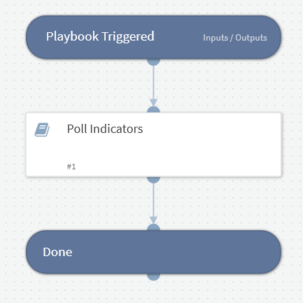

This playbook polls all indicators to check if they exist.

## Dependencies
This playbook uses the following sub-playbooks, integrations, and scripts.

### Sub-playbooks
GenericPolling

### Integrations
This playbook does not use any integrations.

### Scripts
This playbook does not use any scripts.

### Commands
This playbook does not use any commands.

## Playbook Inputs
---

| **Name** | **Description** | **Default Value** | **Required** |
| --- | --- | --- | --- |
| indicators | The indicators to check. |  | Required |
| frequency | How often to check \(in minutes\). | 1 | Required |
| timeout | When to timeout \(in minutes\). | 10 | Required |

## Playbook Outputs
---
There are no outputs for this playbook.

## Playbook Image
---

