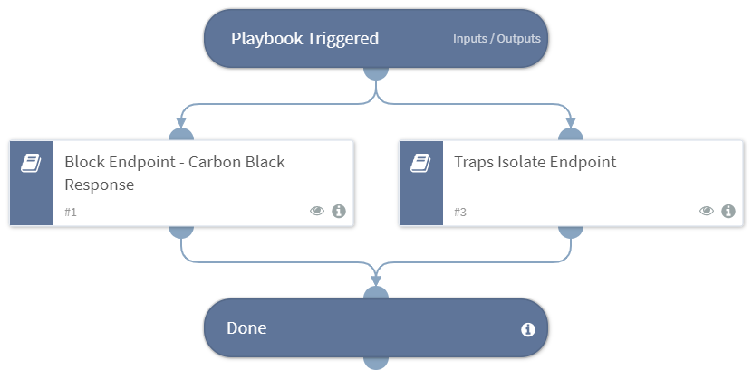

Isolates a given endpoint using the following integrations:
- Carbon Black Enterprise Response
- Palo Alto Networks Traps

## Dependencies
This playbook uses the following sub-playbooks, integrations, and scripts.

### Sub-playbooks
* Block Endpoint - Carbon Black Response
* Traps Isolate Endpoint
* Isolate Endpoint - Cybereason

### Integrations
This playbook does not use any integrations.

### Scripts
This playbook does not use any scripts.

### Commands
This playbook does not use any commands.

## Playbook Inputs
---

| **Name** | **Description** | **Required** |
| --- | --- | --- | 
| Hostname | The hostname of the endpoint to block. | Optional |
| EndpointId | The Endpoint ID to isolate using Traps. | Optional |

## Playbook Outputs
---

| **Path** | **Description** | **Type** |
| --- | --- | --- |
| CbResponse.Sensors.CbSensorID | The Carbon Black Response Sensors IDs that has been isolated. | string |
| Endpoint | The isolated Endpoint. | string |
| Traps.Isolate.EndpointID | The ID of the Endpoint. | string |
| Traps.IsolateResult.Status | The status of the isolation operation. | string |

## Playbook Image
---
<!-- disable-secrets-detection-start -->

<!-- disable-secrets-detection-end -->