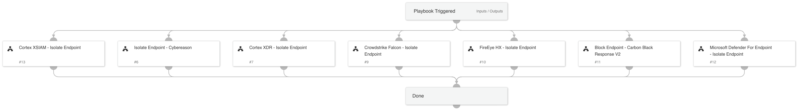

This playbook isolates a given endpoint using various endpoint product integrations.
Make sure to provide valid playbook inputs for the integration you are using.

## Dependencies

This playbook uses the following sub-playbooks, integrations, and scripts.

### Sub-playbooks

* Microsoft Defender For Endpoint - Isolate Endpoint
* FireEye HX - Isolate Endpoint
* Block Endpoint - Carbon Black Response V2.1
* Isolate Endpoint - Cybereason
* Crowdstrike Falcon - Isolate Endpoint
* Cortex XDR - Isolate Endpoint

### Integrations

This playbook does not use any integrations.

### Scripts

This playbook does not use any scripts.

### Commands

* core-isolate-endpoint

## Playbook Inputs

---

| **Name** | **Description** | **Default Value** | **Required** |
| --- | --- | --- | --- |
| Endpoint_hostname | The host name of the endpoint to isolate. |  | Optional |
| Endpoint_ip | The IP of the endpoint to isolate. |  | Optional |
| Endpoint_id | The ID of the endpoint to isolate. |  | Optional |

## Playbook Outputs

---

| **Path** | **Description** | **Type** |
| --- | --- | --- |
| Endpoint | The isolated endpoint. | string |
| Traps.Isolate.EndpointID | The ID of the endpoint. | string |
| Traps.IsolateResult.Status | The status of the isolation operation. | string |
| Cybereason.Machine | The Cybereason machine name. | unknown |
| Cybereason.IsIsolated | Whether the machine is isolated. | unknown |
| Endpoint.Hostname | The host name of the endpoint. | unknown |
| PaloAltoNetworksXDR.Endpoint.endpoint_id | The endpoint ID. | unknown |
| PaloAltoNetworksXDR.Endpoint.endpoint_name | The endpoint name. | unknown |
| PaloAltoNetworksXDR.Endpoint.endpoint_status | The status of the endpoint. | unknown |
| PaloAltoNetworksXDR.Endpoint.ip | The endpoint's IP address. | unknown |
| PaloAltoNetworksXDR.Endpoint.is_isolated | Whether the endpoint is isolated. | unknown |
| MicrosoftATP.MachineAction.ID | The machine action ID. | string |
| MicrosoftATP.IsolateList | The IDs of the machines that were isolated. | string |
| MicrosoftATP.NonIsolateList | The IDs of the machines that will not be isolated. | string |
| MicrosoftATP.IncorrectIDs | Incorrect device IDs entered. | string |
| MicrosoftATP.IncorrectHostnames | Incorrect device host names entered. | string |
| MicrosoftATP.IncorrectIPs | Incorrect device IPs entered. | string |
| Core.Isolation.endpoint_id | The ID of the isolated endpoint. | string |
| CarbonBlackEDR.Sensor | The sensor info. | unknown |
| CarbonBlackEDR.Sensor.id | The sensor id of this sensor. | unknown |
| CarbonBlackEDR.Sensor.is_isolating | Boolean representing the sensor-reported isolation status. | unknown |
| CarbonBlackEDR.Sensor.status | The sensor status. | unknown |

## Playbook Image

---

