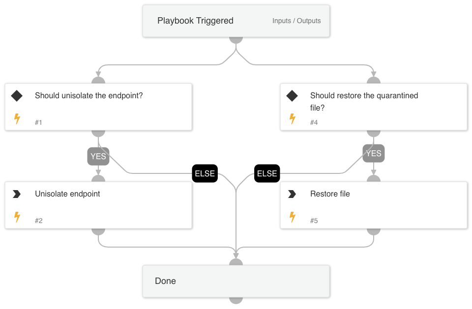

This playbook handles all the recovery actions available with Cortex XSIAM, including the following tasks:
* Unisolate endpoint
* Restore quarantined file

**Note:** The playbook inputs enable manipulating the execution flow; read the input descriptions for details.

## Dependencies
This playbook uses the following sub-playbooks, integrations, and scripts.

### Sub-playbooks
This playbook does not use any sub-playbooks.

### Integrations
This playbook does not use any integrations.

### Scripts
This playbook does not use any scripts.

### Commands
* core-unisolate-endpoint
* core-restore-file

## Playbook Inputs
---

| **Name** | **Description** | **Default Value** | **Required** |
| --- | --- | --- | --- |
| unIsolateEndpoint | Set to True to cancel the endpoint isolation. | True | Optional |
| releaseFile | Set to True to release the quarantined file. | False | Optional |
| endpointID | The endpoint ID. |  | Optional |
| FileHash | The file hash. |  | Optional |

## Playbook Outputs
---
There are no outputs for this playbook.

## Playbook Image
---

