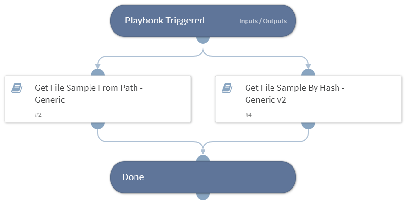

Deprecated. Use `Retrieve File from Endpoint - Generic V3` instead. 
This playbook retrieves a file sample from an endpoint using the following playbooks:
- Get File Sample From Path - Generic
- Get File Sample By Hash - Generic v2

## Dependencies

This playbook uses the following sub-playbooks, integrations, and scripts.

### Sub-playbooks

* Get File Sample From Path - Generic
* Get File Sample By Hash - Generic v2

### Integrations

This playbook does not use any integrations.

### Scripts

This playbook does not use any scripts.

### Commands

This playbook does not use any commands.

## Playbook Inputs

---

| **Name** | **Description** | **Default Value** | **Required** |
| --- | --- | --- | --- |
| MD5 | Get file sample from MD5 input. | File.MD5 | Optional |
| SHA256 | Get file sample from SHA256 input. | File.SHA256 | Optional |
| Hostname | Hostname of the machine on which the file is located. | Endpoint.Hostname | Optional |
| Path | File path. | File.Path | Optional |
| UseD2 | Determines whether a D2 agent will be used to retrieve the file. Default is no. | no | Optional |

## Playbook Outputs

---
There are no outputs for this playbook.

## Playbook Image

---

