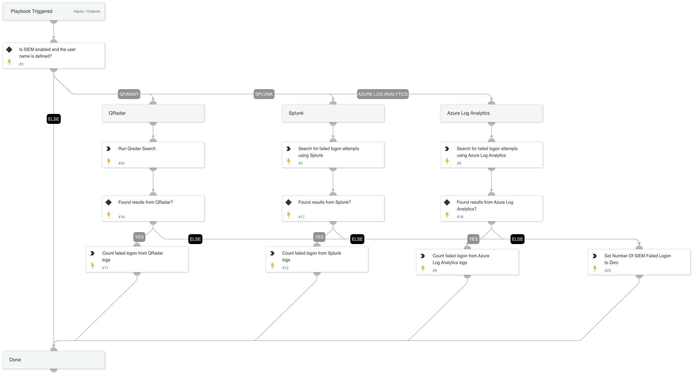

This playbook searches for failed logon on a specific user by querying logs from different sources.

Supported Integrations:
-Splunk
-QRadar
-Azure Log Analytics

## Dependencies
This playbook uses the following sub-playbooks, integrations, and scripts.

### Sub-playbooks
* Search for failed logon attempts using QRadar

### Integrations
This playbook does not use any integrations.

### Scripts
* Set
* CountArraySize

### Commands
* splunk-search
* azure-log-analytics-execute-query

## Playbook Inputs
---

| **Name** | **Description** | **Default Value** | **Required** |
| --- | --- | --- | --- |
| SplunkIndex | Splunk's index name in which to search. Default is "\*" - All. | * | Optional |
| SplunkEarliestTime | The earliest time for the Splunk search query. | -1d | Optional |
| SplunkLatestTime | The latest time for the Splunk search query. | now | Optional |
| QRadarSearchTime | The Search Time for the QRadar search query. for example:  Last 1 days | Last 1 days | Optional |
| AzureSearchTime | The Search Time for the Azure Log Analytics search query. for example: ago\(1d\) | ago(1d) | Optional |
| Username | User name. |  | Optional |

## Playbook Outputs
---

| **Path** | **Description** | **Type** |
| --- | --- | --- |
| NumOfSiemFailedLogon | Number of failed login from Siem. | unknown |
| QRadar.Search.Result | The result of the QRadar search. | unknown |
| Splunk.Result | The results of the Splunk search. The results are a JSON array, in which each item is a Splunk event. | unknown |
| AzureFailedLogonLogs | The result of the Azure Log Analytics search. | unknown |

## Playbook Image
---
