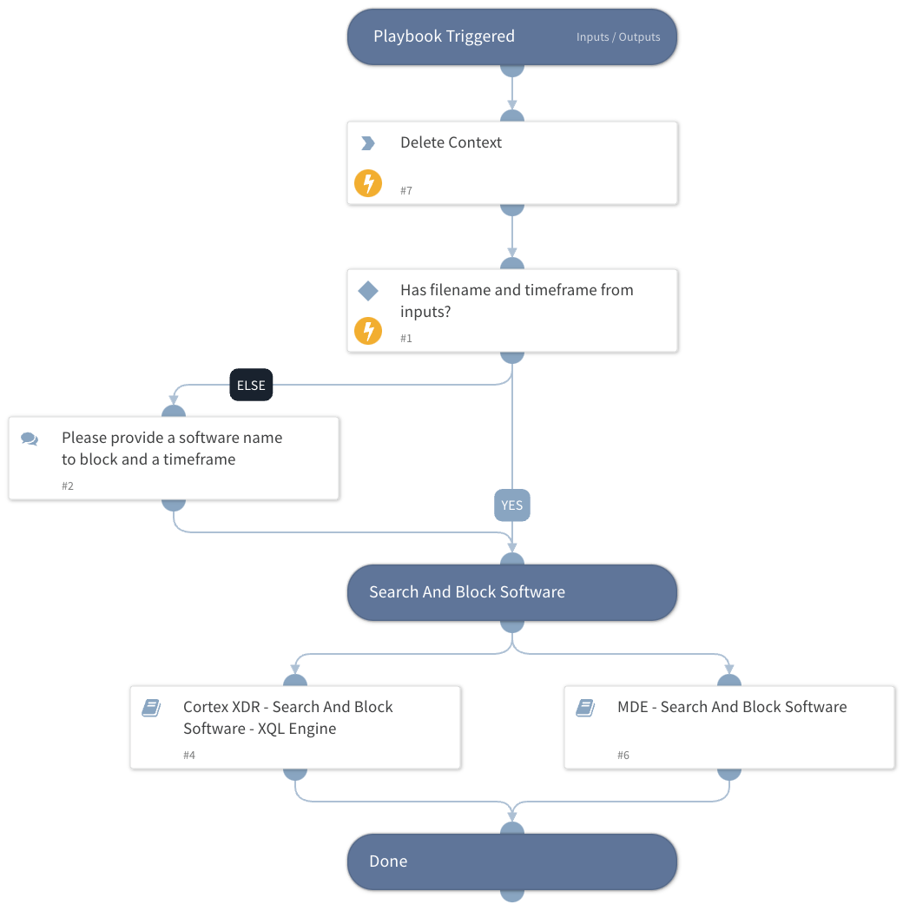

This playbook will search a file or process activity of a software by a given image file name. The analyst can then choose the files to block.
The following integrations are supported:

- Cortex XDR XQL Engine 
- Microsoft Defender For Endpoint

## Dependencies

This playbook uses the following sub-playbooks, integrations, and scripts.

### Sub-playbooks

* MDE - Search And Block Software
* Cortex XDR - Search And Block Software - XQL Engine

### Integrations

This playbook does not use any integrations.

### Scripts

* DeleteContext

### Commands

This playbook does not use any commands.

## Playbook Inputs

---

| **Name** | **Description** | **Default Value** | **Required** |
| --- | --- | --- | --- |
| FileName | File name to search |  | Optional |
| TimeFrame | Time in relative date or range format \(for example: "1 day", "3 weeks ago", "between 2021-01-01 12:34:56 \+02:00 and 2021-02-01 12:34:56 \+02:00"\). The default is the last 24 hours. |  | Optional |
| Indicator Expiration | DateTime string indicating when the indicator expires. Format: \(&lt;number&gt; &lt;time unit&gt;, e.g., 12 hours, 7 days\). |  | Optional |

## Playbook Outputs

---
There are no outputs for this playbook.

## Playbook Image

---

