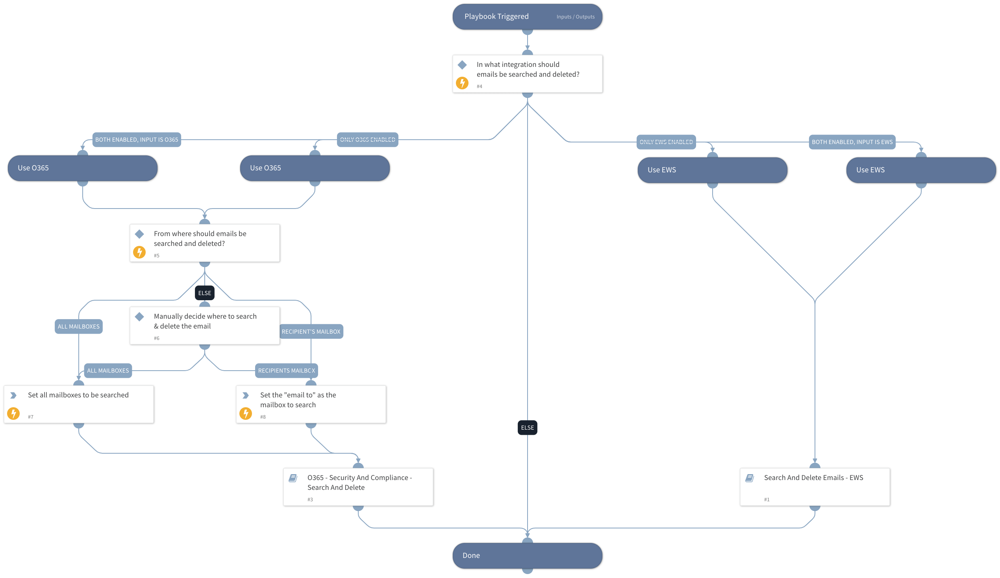

This playbook searches and deletes emails with similar attributes of a malicious email using one of the following integrations: * EWS * Microsoft Graph Security * Gmail * Agari Phishing Defense.

## Dependencies

This playbook uses the following sub-playbooks, integrations, and scripts.

### Sub-playbooks

* Microsoft Graph Security - Search And Delete Emails
* Search And Delete Emails - EWS
* Search And Delete Emails - Gmail

### Integrations

* Agari Phishing Defense

### Scripts

* DeleteContext
* GetTime
* Set

### Commands

* apd-remediate-message

## Playbook Inputs

---

| **Name** | **Description** | **Default Value** | **Required** |
| --- | --- | --- | --- |
| From | The value of the malicious email's "From" attribute. | incident.emailfrom | Optional |
| Subject | The value of the malicious email's "Subject" attribute. | incident.emailsubject | Optional |
| AttachmentName | The value of the malicious email's "AttachmentName" attribute. | incident.attachmentname | Optional |
| SearchAndDeleteIntegration | The integration in which to run the search and delete action. Can be MS Graph, Gmail, EWS, or Agari Phishing Defense. |  | Required |
| SearchThisWeek | Whether to limit the search to the current week. | true | Optional |
| MsgCase | Used only with Microsoft Graph Security. The eDiscovery case name to use. Looked up by name and created if missing. | XSOAR Auto Phishing | Required |
| MsgKQL | Used only with Microsoft Graph Security. KQL query identifying the emails to search and delete. Built automatically from the From, Subject, and AttachmentName inputs if left empty. |  | Optional |
| MsgRecipients | Used only with Microsoft Graph Security. CSV of recipient email addresses to scope the search when MsgMailboxScope is recipientsOnly. | incident.emailto | Optional |
| MsgMailboxScope | Used only with Microsoft Graph Security. Determines which mailboxes to search. Use recipientsOnly to limit to specific recipients, allTenantMailboxes to search the entire tenant. |  | Optional |
| MsgDeleteType | Used only with Microsoft Graph Security. The delete type to perform on the search results. Possible values are Hard or Soft, or leave empty to select manually \(Hard = unrecoverable, Soft = recoverable\). |  | Optional |
| MsgMailboxExclusion | Used only with Microsoft Graph Security. CSV of mailboxes to exclude from the search. Honored only when MsgMailboxScope is allTenantMailboxes. Note: exclusion works at the message level, not the mailbox level — see subplaybook description for details. |  | Optional |

## Playbook Outputs

---
There are no outputs for this playbook.

## Playbook Image

---

