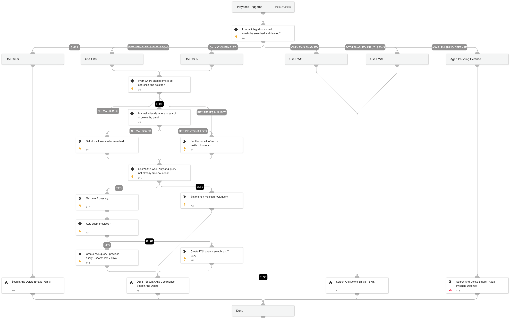

This playbook searches and deletes emails with similar attributes of a malicious email using one of the following integrations: * EWS * Office 365 * Gmail * Agari Phishing Defense

## Dependencies

This playbook uses the following sub-playbooks, integrations, and scripts.

### Sub-playbooks

* Search And Delete Emails - EWS
* O365 - Security And Compliance - Search And Delete
* Search And Delete Emails - Gmail

### Integrations

* Agari Phishing Defense

### Scripts

* Set

### Commands

* apd-remediate-message

## Playbook Inputs

---

| **Name** | **Description** | **Default Value** | **Required** |
| --- | --- | --- | --- |
| From | The value of the malicious email's "From" attribute. | incident.emailfrom | Optional |
| Subject | The value of the malicious email's "Subject" attribute. | incident.emailsubject | Optional |
| AttachmentName | The value of the malicious email's "AttachmentName" attribute. | incident.attachmentname | Optional |
| SearchAndDeleteIntegration | The integration in which to run the search and delete action. Can be O365, Gmail, EWS, or Agari Phishing Defense. |  | Required |
| O365ExchangeLocation | Used only in O365. A comma-separated list of mailboxes/distribution groups to include, or use the value "All" to include all. | incident.emailto | Optional |
| O365KQL | Used only in O365. Text search string or a query that is formatted using the Keyword Query Language \(KQL\). |  | Optional |
| O365AllowNotFoundExchangeLocations | Used only in O365. Whether to include mailboxes other than regular user mailboxes in the compliance search. | False | Optional |
| O365DeleteType | Used only in O365. The delete type to perform on the search results. Possible values are Hard or Soft, or leave empty to select manually \(Hard = Unrecoverable, Soft=Recoverable\). |  | Optional |
| O365ExchangeLocationExclusion | Used only when searching and deleting emails in O365. The exchange location. Determines where to search and delete emails searched using O365 playbooks. Use the value 'All' to search all mailboxes, use 'SingleMailbox' to search and delete the email only from the recipient's inbox, or use 'Manual' to decide manually for every incident. Note: Searching all mailboxes may take a significant amount of time. |  | Optional |
| SearchThisWeek | Whether to limit the search to the current week. | true | Optional |

## Playbook Outputs

---
There are no outputs for this playbook.

## Playbook Image

---

