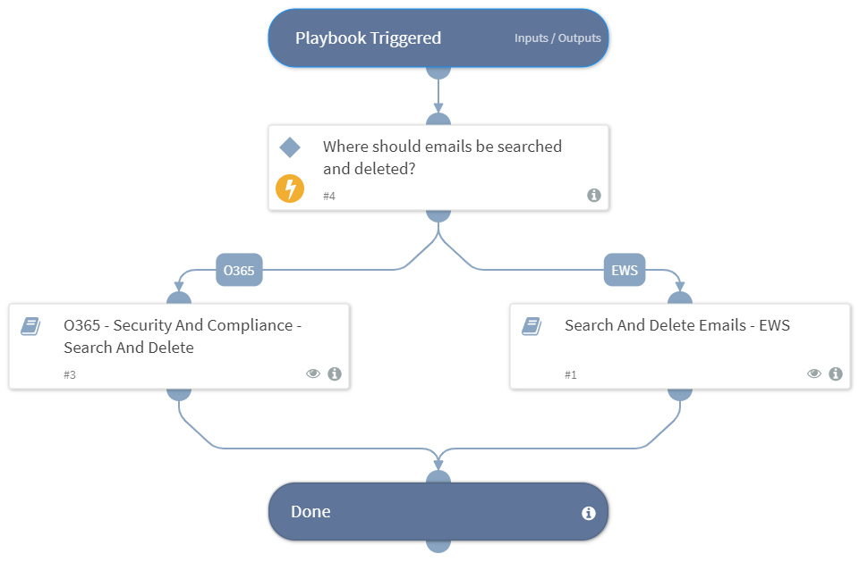

Deprecated. Use `Search And Delete Emails - Generic v2` instead. This playbook searches and delete emails with similar attributes of a malicious email.

## Dependencies

This playbook uses the following sub-playbooks, integrations, and scripts.

### Sub-playbooks

* Search And Delete Emails - EWS

### Integrations

This playbook does not use any integrations.

### Scripts

This playbook does not use any scripts.

### Commands

This playbook does not use any commands.

## Playbook Inputs

---

| **Name** | **Description** | **Default Value** | **Required** |
| --- | --- | --- | --- |
| From | The value of the malicious email's "From" attribute. | incident.emailfrom | Optional |
| Subject | The value of the malicious email's "Subject" attribute. | incident.emailsubject | Optional |
| AttachmentName | The value of the malicious email's "AttachmentName" attribute. | incident.attachmentname | Optional |

## Playbook Outputs

---
There are no outputs for this playbook.

## Playbook Image

---

