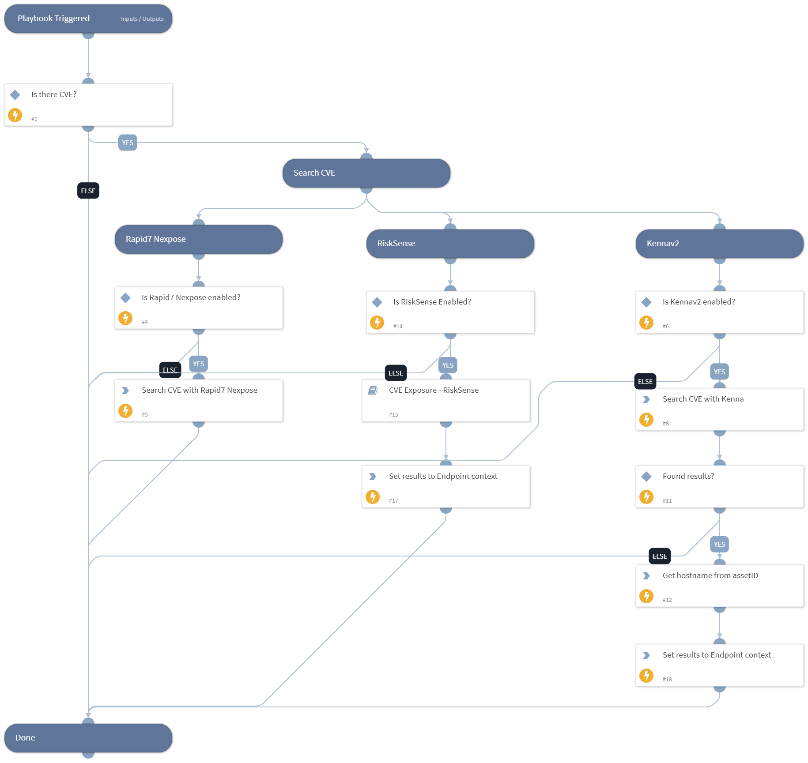

Hunt for assets with a given CVE using available tools

## Dependencies

This playbook uses the following sub-playbooks, integrations, and scripts.

### Sub-playbooks

* CVE Exposure - RiskSense

### Integrations

This playbook does not use any integrations.

### Scripts

* SetAndHandleEmpty

### Commands

* kenna-search-vulnerabilities
* kenna-search-assets
* nexpose-search-assets

## Playbook Inputs

---

| **Name** | **Description** | **Default Value** | **Required** |
| --- | --- | --- | --- |
| CVE_ID | The CVE ID |  | Optional |

## Playbook Outputs

---

| **Path** | **Description** | **Type** |
| --- | --- | --- |
| Kenna.Assets | Compromised Assets from Kenna | unknown |
| Nexpose.Asset | Compromised Assets from Nexpose | unknown |
| Endpoint | Global compromised Assets | unknown |

## Playbook Image

---

