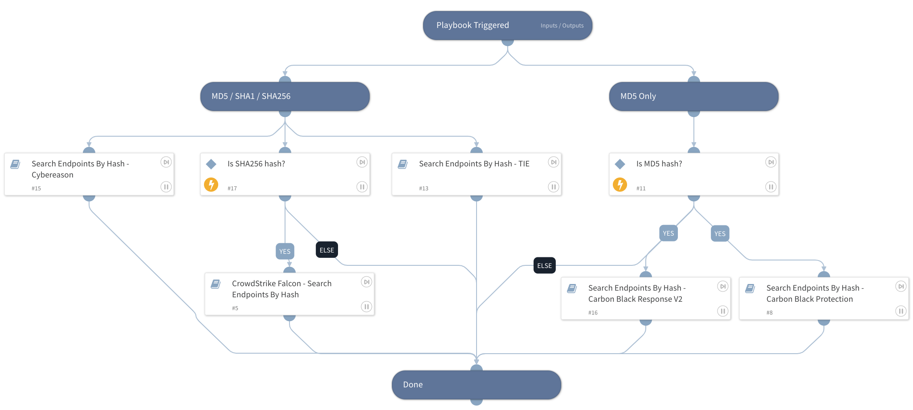

Hunt using available tools

## Dependencies
This playbook uses the following sub-playbooks, integrations, and scripts.

### Sub-playbooks
* CrowdStrike Falcon - Search Endpoints By Hash
* Search Endpoints By Hash - Cybereason
* Search Endpoints By Hash - TIE
* Search Endpoints By Hash - Carbon Black Response V2
* Search Endpoints By Hash - Carbon Black Protection

### Integrations
This playbook does not use any integrations.

### Scripts
This playbook does not use any scripts.

### Commands
This playbook does not use any commands.

## Playbook Inputs
---

| **Name** | **Description** | **Default Value** | **Required** |
| --- | --- | --- | --- |
| MD5Hash | MD5 Hash | File.MD5 | Optional |
| SHA1Hash | SHA1 Hash | File.SHA1 | Optional |
| SHA256Hash | SHA256 Hash | File.SHA256 | Optional |

## Playbook Outputs
---

| **Path** | **Description** | **Type** |
| --- | --- | --- |
| Endpoint.Hostname | Device hostname | string |
| Endpoint | The endpoint | unknown |

## Playbook Image
---
