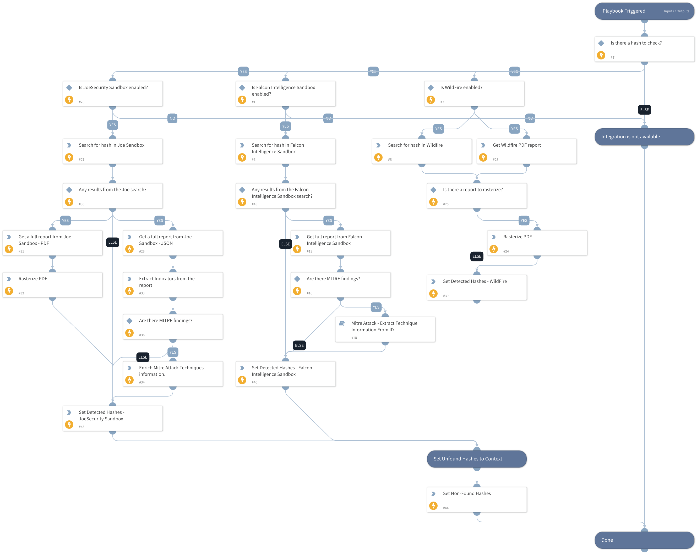

This playbook searches for a specific hash in the supported sandboxes. If the hash is known, the playbook provides a detailed analysis of the sandbox report. Currently, supported sandboxes are Falcon Intelligence Sandbox, Wildfire and Joe Sandbox. 

## Dependencies

This playbook uses the following sub-playbooks, integrations, and scripts.

### Sub-playbooks

* Mitre Attack - Extract Technique Information From ID

### Integrations

This playbook does not use any integrations.

### Scripts

* SetAndHandleEmpty
* IsIntegrationAvailable

### Commands

* cs-fx-get-full-report
* cs-fx-find-reports
* extractIndicators
* attack-pattern
* wildfire-report
* joe-download-report
* rasterize-pdf
* joe-search

## Playbook Inputs

---

| **Name** | **Description** | **Default Value** | **Required** |
| --- | --- | --- | --- |
| FileSha256 | The SHA256 hash to search for. |  | Optional |

## Playbook Outputs

---

| **Path** | **Description** | **Type** |
| --- | --- | --- |
| AttackPattern | The MITRE Attack pattern information. | unknown |
| MITREATTACK | Full MITRE data for the attack pattern. | unknown |
| NonFoundHashes | A list of hashes that are not found in the sandboxes. | string |
| WildFire.Report | The results of the Wildfire report. | string |
| csfalconx.resource.sandbox | The results of the Falcon Intelligence Sandbox report. | string |
| DetectedHashes | A list of hashes that were detected by the sandboxes. | string |

## Playbook Image

---

