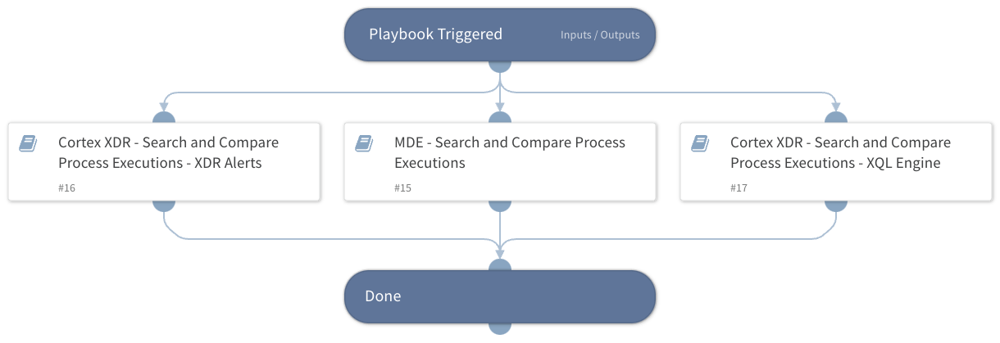

This playbook is a generic playbook that receives process name and command-line argument and search for the given process executions and compare the command-line argument from the results to the command-line argument received from the playbook input. The playbook supports searching process executions using the following integrations:

- Cortex XDR XQL Engine
- Cortex XDR IR(Search executions inside XDR alerts)
- Microsoft Defender For Endpoint

Notice - under the input "Processes", the playbook should receive an array that contains the following keys:
-value: *process name*
-commands: *command-line arguments*

## Dependencies

This playbook uses the following sub-playbooks, integrations, and scripts.

### Sub-playbooks

* 8602fe71-fe87-452f-88d7-eaa3c51c2511
* c3e7d503-6939-487f-8b6b-b047c352090b
* a418058c-fc0a-471c-8edc-ac8ff52399cc

### Integrations

This playbook does not use any integrations.

### Scripts

This playbook does not use any scripts.

### Commands

This playbook does not use any commands.

## Playbook Inputs

---

| **Name** | **Description** | **Default Value** | **Required** |
| --- | --- | --- | --- |
| Processes | List of processes names and command line arguments to search |  | Optional |
| HuntingTimeFrame | Time in relative date or range format \(for example: "1 day", "3 weeks ago", "between 2021-01-01 12:34:56 \+02:00 and 2021-02-01 12:34:56 \+02:00"\). The default is the last 24 hours. | 7 days | Optional |
| StringSimilarityThreshold | StringSimilarity automation threshold: A number between 0 and 1, where 1 represents the most similar results of string comparisons. The automation will output only the results with a similarity score equal to or greater than the specified threshold. | 0.5 | Optional |

## Playbook Outputs

---

| **Path** | **Description** | **Type** |
| --- | --- | --- |
| StringSimilarity | StringSimilarity results. | unknown |
| Findings | Suspicious process executions found. | unknown |

## Playbook Image

---

