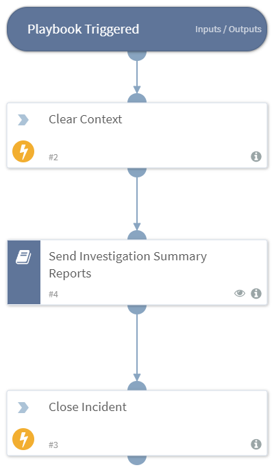

Calls the sub-playbook, `Send Investigation Summary Reports`, and closes the incident. By default, the playbook will search all incidents closed within the last hour. This playbook should be run as as a scheduled job, whicn should run on a 15 minute interval. If you want to run the playbook more frequently, you should adjust the search query of the child playbook, `Send Investigation Summary`. Reports.

## Dependencies
This playbook uses the following sub-playbooks, integrations, and scripts.

### Sub-playbooks
* Send Investigation Summary Reports

### Integrations
* Builtin

### Scripts
* DeleteContext

### Commands
* closeInvestigation

## Playbook Inputs
---
There are no inputs for this playbook.

## Playbook Outputs
---
There are no outputs for this playbook.

## Playbook Image
---

