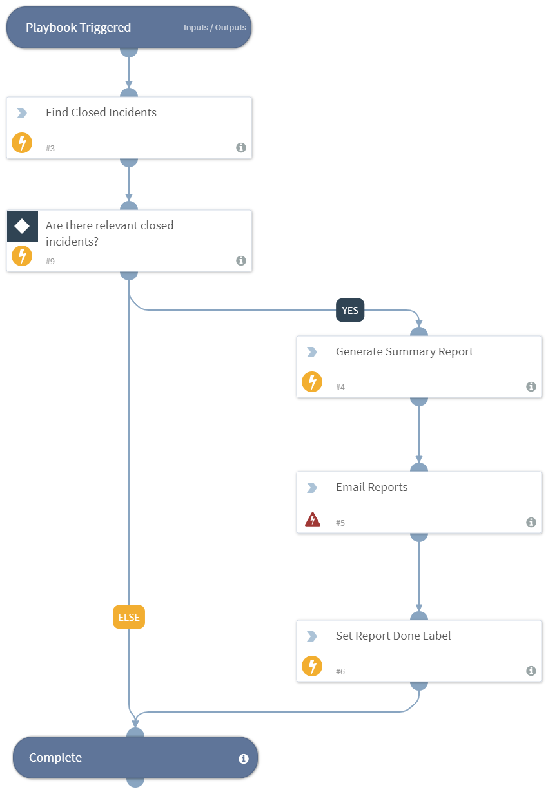

Iterates over closed incidents, generates a summary report for each closed incident, and emails the reports to specified users. 

## Dependencies
This playbook uses the following sub-playbooks, integrations, and scripts.

### Sub-playbooks
This playbook does not use any sub-playbooks.

### Integrations
* Builtin

### Scripts
* SearchIncidentsV2
* GenerateSummaryReports
* Exists

### Commands
* send-mail
* setIncident

## Playbook Inputs
---

| **Name** | **Description** | **Default Value** | **Required** |
| --- | --- | --- | --- | 
| MailTo | The email address to mail the report to. | None | Required |
| ReportName | The reports to generate. | Investigation Summary | Optional |
| ReportType | The type of report. | pdf | Optional |
| IncidentSearchQuery | The query used to search for incidents. Default query will search for all incidents closed within the last hour. | -category:job status:closed closed:>="1 hour ago" | Optional |

## Playbook Outputs
---
There are no outputs for this playbook.

## Playbook Image
---

