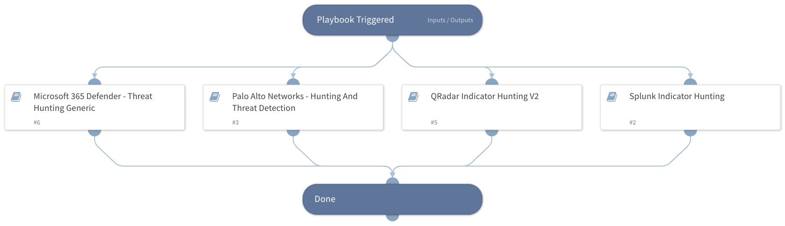

This playbook enables threat hunting for IOCs in your enterprise. It currently supports the following integrations: 
- Splunk
- Qradar
- Pan-os 
- Cortex data lake 
- Autofocus
- Microsoft 365 Defender

## Dependencies
This playbook uses the following sub-playbooks, integrations, and scripts.

### Sub-playbooks
* QRadar Indicator Hunting V2
* Microsoft 365 Defender - Threat Hunting Generic
* Splunk Indicator Hunting
* Palo Alto Networks - Hunting And Threat Detection

### Integrations
This playbook does not use any integrations.

### Scripts
This playbook does not use any scripts.

### Commands
This playbook does not use any commands.

## Playbook Inputs
---

| **Name** | **Description** | **Default Value** | **Required** |
| --- | --- | --- | --- |
| MD5 | The MD5 hash file or an array of hashes to search. |  | Optional |
| SHA256 | The SHA256 hash file or an array of hashes to search. |  | Optional |
| SHA1 | The SHA1 hash file or an array of hashes to search. |  | Optional |
| IPAddress | The source or destination IP address to search. Can be a single address or an array of list of addresses.  |  | Optional |
| URLDomain | Domain or URL to search. Can be a single domain or URL or an array of domains or URLs to search. By default, the LIKE clause is used. |  | Optional |
| InternalRange | A comma-separated list of internal IP ranges to check IP addresses against. The list should be provided in CIDR notation. An example of a list of ranges would be: "172.16.0.0/12,10.0.0.0/8,192.168.0.0/16" \(without quotes\). If a list is not provided, uses the default list provided in the IsIPInRanges script \(the known IPv4 private address ranges\). |  | Optional |
| InternalDomainName | The organization's internal domain name. This is provided for the script IsInternalHostName that checks if the detected hostnames are internal or external, if the hosts contain the internal domains suffix. For example, paloaltonetworks.com. If there is more than one domain, use the \| character to separate values such as \(paloaltonetworks.com\|test.com\). |  | Optional |
| InternalHostRegex | Provided for the script IsInternalHostName that checks if the detected host names are internal or external, if the hosts match the organization's naming convention. For example, the host testpc1 will have the following regex \\w\{6\}\\d\{1\} |  | Optional |
| QRadarTimeFrame | The time frame to search in QRadar. | LAST 7 DAYS | Optional |
| SplunkEarliestTime | The earliest time to search in Splunk. | -7d@d | Optional |
| SplunkLatestTime | The latest time to search in Splunk. | now | Optional |
| MessageID | This input will be used in the "Microsoft 365 Defender - Get Email URL clicks" playbook. MessageID of the email from which the URL was clicked. Please note that this can be either of the following 2 values: - The value of the header "Message-ID". - The internal ID of the message within Microsoft's products \(e.g.   NetworkMessageId\).  Can be a single MessageID or an array of MessageIDs to search. |  | Optional |

## Playbook Outputs
---

| **Path** | **Description** | **Type** |
| --- | --- | --- |
| Splunk.DetectedUsers | Users detected based on the username field in your search. | string |
| Splunk.DetectedInternalIPs | Internal IP addresses detected by your search. | string |
| Splunk.DetectedExternalIPs | External IP addresses detected by your search. | string |
| Splunk.DetectedInternalHosts | Internal hostnames detected based on the fields in your search. | string |
| Splunk.DetectedExternalHosts | External hostnames detected based on the fields in your search. | string |
| PANWHunting.DetectedUsers | User or array of users that were detected during hunting. | string |
| PANWHunting.DetectedInternalIPs | Internal IP addresses detected based on fields and inputs in your search. | string |
| PANWHunting.DetectedExternalIPs | External IP addresses detected based on fields and inputs in your search. | string |
| PANWHunting.DetectedInternalHosts | Internal hostnames detected based on fields and inputs in your search. | string |
| PANWHunting.DetectedExternalHosts | External hostnames detected based on fields and inputs in your search. | string |
| QRadar.DetectedUsers | Users detected based on the username field in your search. | string |
| QRadar.DetectedInternalIPs | Internal IP addresses detected based on fields and inputs in your search. | string |
| QRadar.DetectedExternalIPs | External IP addresses detected based on fields and inputs in your search. | string |
| QRadar.DetectedInternalHosts | Internal host names detected based on hosts in your assets table. Note that the data accuracy depends on how the asset mapping is configured in QRadar. | string |
| QRadar.DetectedExternalHosts | External host names detected based on hosts in your assets table. Note that the data accuracy depends on how the asset mapping is configured in QRadar. | string |
| Microsoft365Defender.RetrievedEmails | Email objects containing relevant fields. | string |
| Microsoft365Defender.RetrievedEmails.InternetMessageId | Internet Message ID of the email. | string |
| Microsoft365Defender.RetrievedEmails.SenderFromDomain | Sender domain. | string |
| Microsoft365Defender.RetrievedEmails.EmailDirection | Email direction \(inbound/outbound\). | string |
| Microsoft365Defender.RetrievedEmails.DeliveryLocation | Delivery location. | string |
| Microsoft365Defender.RetrievedEmails.AuthenticationDetails | Authentication details \(SPF, DKIM, DMARC, CompAuth\) | string |
| Microsoft365Defender.RetrievedEmails.DeliveryAction | Email subject. | string |
| Microsoft365Defender.RetrievedEmails.AttachmentCount | Number of attachments. | string |
| Microsoft365Defender.RetrievedEmails.ThreatNames | Threat names. | string |
| Microsoft365Defender.RetrievedEmails.RecipientEmailAddress | Recipient email address. | string |
| Microsoft365Defender.RetrievedEmails.EmailAction | Email action. | string |
| Microsoft365Defender.RetrievedEmails.EmailLanguage | Email language. | string |
| Microsoft365Defender.RetrievedEmails.SenderFromAddress | Sender address. | string |
| Microsoft365Defender.RetrievedEmails.Timestamp | Timestamp. | string |
| Microsoft365Defender.RetrievedEmails.SenderDisplayName | Sender display name. | string |
| Microsoft365Defender.RetrievedEmails.SenderIPv4 | Sender IPv4. | string |
| Microsoft365Defender.RetrievedEmails.ConfidenceLevel | Threat types. | string |
| Microsoft365Defender.RetrievedEmails.SHA256 | SHA256 of the attachments \(if exist in the email\). | string |
| Microsoft365Defender.RetrievedEmails.Url | URLs found in the email's body. | string |
| Microsoft365Defender.RetrievedEmails.UrlCount | Number of URLs found in the email's body. | string |
| Microsoft365Defender.RetrievedEmails.SenderIPv6 | Sender IPv6. | string |
| Microsoft365Defender.RetrievedEmails.AccountUpn | User principal name \(UPN\) of the account. | string |
| Microsoft365Defender.RetrievedEmails.IsClickedThrough | Indicates whether the user was able to click through to the original URL or not. | number |
| Microsoft365Defender.RetrievedEmails.BulkComplaintLevel | Threshold assigned to email from bulk mailers, a high bulk complain level \(BCL\) means the email is more likely to generate complaints, and thus more likely to be spam. | string |
| Microsoft365Defender.RetrievedEmails.IPAddress | IP address assigned to the device during communication. | string |
| Microsoft365Defender.RetrievedEmails.DetectionMethods | Methods used to detect whether the URL contains or leads to malware, phishing, or other threats. | string |
| Microsoft365Defender.RetrievedEmails.ActionType | Type of activity that triggered the event. | string |
| Microsoft365Defender.RetrievedEmails.UrlChain | List of URLs in the redirection chain. | string |
| Microsoft365Defender.RetrievedEmails.NetworkMessageId | Unique identifier for the email, generated by Office 365. | string |
| Microsoft365Defender.RetrievedEmails.DisplayName | Name of the sender displayed in the address book, typically a combination of a given or first name, a middle initial, and a last name or surname. | string |
| Microsoft365Defender.RetrievedEmails.SenderMailFromDomain | Sender domain in the MAIL FROM header, also known as the envelope sender or the Return-Path address. | string |
| Microsoft365Defender.RetrievedEmails.SenderMailFromAddress | Sender email address in the MAIL FROM header, also known as the envelope sender or the Return-Path address. | string |
| Microsoft365Defender.RetrievedEmails.Subject | Subject of the email. | string |
| Microsoft365Defender.RetrievedEmails.ThreatTypes | Verdict from the email filtering stack on whether the email contains malware, phishing, or other threats. | unknown |

## Playbook Image
---
