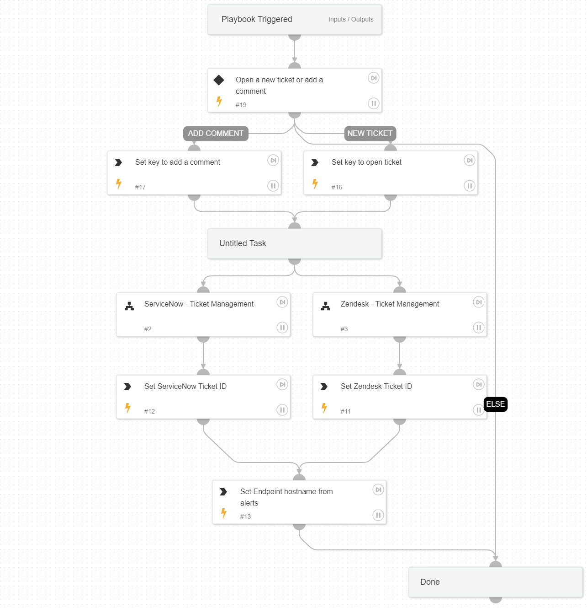

`Ticket Management - Generic` allows you to open new tickets or update comments to the existing ticket in the following ticketing systems:
-ServiceNow 
-Zendesk 
using the following sub-playbooks:
-`ServiceNow - Ticket Management`
-`Zendesk - Ticket Management`

## Dependencies

This playbook uses the following sub-playbooks, integrations, and scripts.

### Sub-playbooks

* Zendesk - Ticket Management
* ServiceNow - Ticket Management

### Integrations

This playbook does not use any integrations.

### Scripts

Set

### Commands

setParentIncidentContext

## Playbook Inputs

---

| **Name** | **Description** | **Default Value** | **Required** |
| --- | --- | --- | --- |
| serviceNowShortDescription | A short description of the ticket. |  | Optional |
| serviceNowImpact | The impact for the new ticket. Leave empty for ServiceNow default impact. |  | Optional |
| serviceNowUrgency | The urgency of the new ticket. Leave empty for ServiceNow default urgency. |  | Optional |
| serviceNowSeverity | The severity of the new ticket. Leave empty for ServiceNow default severity. |  | Optional |
| serviceNowTicketType | The ServiceNow ticket type. Options are "incident", "problem", "change_request", "sc_request", "sc_task", or "sc_req_item". Default is "incident". |  | Optional |
| serviceNowCategory | The category of the ServiceNow ticket. |  | Optional |
| serviceNowAssignmentGroup | The group to which to assign the new ticket. |  | Optional |
| ZendeskPriority | The urgency with which the ticket should be addressed. Allowed values are "urgent", "high", "normal", or "low". |  | Optional |
| ZendeskRequester | The user who requested this ticket. |  | Optional |
| ZendeskStatus | The state of the ticket. Allowed values are "new", "open", "pending", "hold", "solved", or "closed". |  | Optional |
| ZendeskSubject | The value of the subject field for this ticket. |  | Optional |
| ZendeskTags | The array of tags applied to this ticket. |  | Optional |
| ZendeskType | The type of this ticket. Allowed values are "problem", "incident", "question", or "task". |  | Optional |
| ZendeskAssigne | The agent currently assigned to the ticket. |  | Optional |
| ZendeskCollaborators | The users currently CC'ed on the ticket. |  | Optional |
| description | The ticket description. |  | Optional |
| addCommentPerEndpoint | Whether to append a new comment to the ticket for each endpoint in the incident. Possible values: True/False.  | True | Optional |
| CommentToAdd | Comment for the ticket. |  | Optional |

## Playbook Outputs

---

| **Path** | **Description** | **Type** |
| --- | --- | --- |
| ServiceNow.Ticket.ID | ServiceNow ticket ID. | unknown |
| Zendesk.Ticket.id | Zendesk ticket ID. | unknown |

## Playbook Image

---

