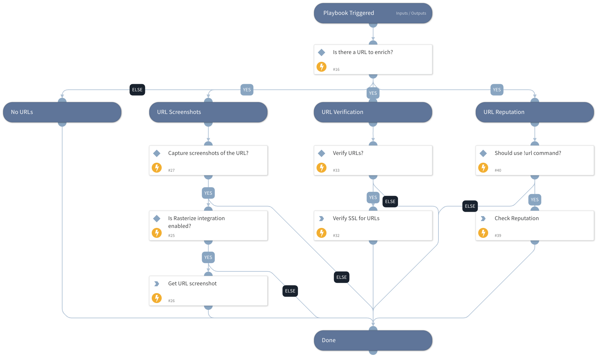

Enrich URLs using one or more integrations.

URL enrichment includes:
* SSL verification for URLs
* Threat information
* Providing of URL screenshots
* URL Reputation using !url

## Dependencies

This playbook uses the following sub-playbooks, integrations, and scripts.

### Sub-playbooks

This playbook does not use any sub-playbooks.

### Integrations

* Rasterize

### Scripts

* URLSSLVerification
* Exists

### Commands

* url
* rasterize

## Playbook Inputs

---

| **Name** | **Description** | **Default Value** | **Required** |
| --- | --- | --- | --- |
| URL | URLs to enrich. | URL.Data | Optional |
| Rasterize | Should the system take safe screenshots of input URLs? | True | Optional |
| VerifyURL | Should the system perform SSL certificate verification on the URLs? | False | Optional |
| UseReputationCommand | Define if you would like to use the \!url command. Note: This input should be used whenever there is no auto-extract enabled in the investigation flow. Possible values: True / False. | False | Required |

## Playbook Outputs

---

| **Path** | **Description** | **Type** |
| --- | --- | --- |
| URL | The URL object. | uknown |
| URL.Data | The enriched URL. | string |
| DBotScore | The DBotScore object. | unknown |
| URL.Malicious | Whether the detected URL was malicious. | unknown |
| URL.Vendor | Vendor that labeled the URL as malicious. | string |
| URL.Description | Additional information for the URL. | string |
| URL.Malicious.Vendor | For malicious URLs, the vendor that made the decision. | unknown |
| URL.Malicious.Description | For malicious URLs, the reason that the vendor made the decision. | unknown |
| DBotScore.Indicator | The indicator | string |
| DBotScore.Type | The indicator's type | string |
| DBotScore.Vendor | The reputation vendor | string |
| DBotScore.Score | The reputation score | number |
| DBotScore.Reliability | Reliability of the source providing the intelligence data. | unknown |

## Playbook Image

---

