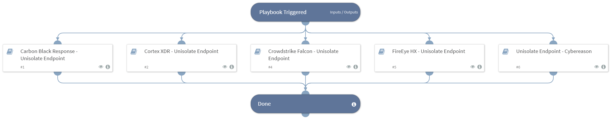

This playbook unisolates endpoints according to the endpoint ID or host name provided in the playbook.
It currently supports the following integrations:
- Carbon Black Response
- Cortex XDR
- Crowdstrike Falcon
- FireEye HX 
- Cybereason
- Microsoft Defender For Endpoint.

## Dependencies

This playbook uses the following sub-playbooks, integrations, and scripts.

### Sub-playbooks

* FireEye HX - Unisolate Endpoint
* Cortex XDR - Unisolate Endpoint
* Crowdstrike Falcon - Unisolate Endpoint
* Microsoft Defender For Endpoint - Unisolate Endpoint
* Unisolate Endpoint - Cybereason
* Carbon Black Response - Unisolate Endpoint

### Integrations

This playbook does not use any integrations.

### Scripts

This playbook does not use any scripts.

### Commands

This playbook does not use any commands.

## Playbook Inputs

---

| **Name** | **Description** | **Default Value** | **Required** |
| --- | --- | --- | --- |
| Endpoint_ID | The endpoint ID/device ID/sensor ID/agent ID that you want to unisolate. |  | Optional |
| Hostname | The host name of the endpoint to unisolate \(using Cybereason or FireEyeHX\). |  | Optional |
| IP | IP address of the endpoint to unisolate. \(using Defender or XDR\) |  | Optional |

## Playbook Outputs

---

| **Path** | **Description** | **Type** |
| --- | --- | --- |
| MicrosoftATP.MachineAction.ID | The machine action ID. | string |
| MicrosoftATP.NonUnisolateList | The machine IDs that will not be released from isolation. | string |
| MicrosoftATP.UnisolateList | The machine IDs that were released from isolation. | string |
| MicrosoftATP.IncorrectIDs | Incorrect device IDs entered. | string |
| MicrosoftATP.IncorrectHostnames | Incorrect device host names entered. | string |
| MicrosoftATP.IncorrectIPs | Incorrect device IPs entered. | string |

## Playbook Image

---

