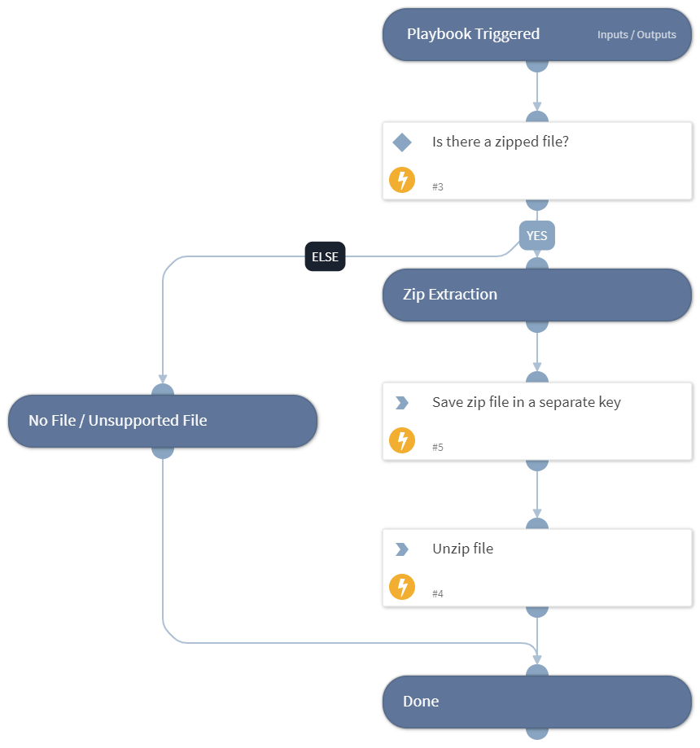

This playbook checks whether a file has an extension that supports unzipping, and unzips the file.

## Dependencies
This playbook uses the following sub-playbooks, integrations, and scripts.

### Sub-playbooks
This playbook does not use any sub-playbooks.

### Integrations
This playbook does not use any integrations.

### Scripts
* Set
* UnzipFile

### Commands
This playbook does not use any commands.

## Playbook Inputs
---

| **Name** | **Description** | **Default Value** | **Required** |
| --- | --- | --- | --- |
| File | A file object. | File | Optional |
| Password | The password used to protect the zipped file. Required for unzipping password-protected files. |  | Optional |
| ZipTool | The tool used to unzip the file. The options are: 7z, zipfile. | 7z | Optional |

## Playbook Outputs
---

| **Path** | **Description** | **Type** |
| --- | --- | --- |
| ExtractedFiles | Files that were unzipped. | unknown |
| File | File objects - includes the zipped file and any unzipped files. | unknown |

## Playbook Image
---
