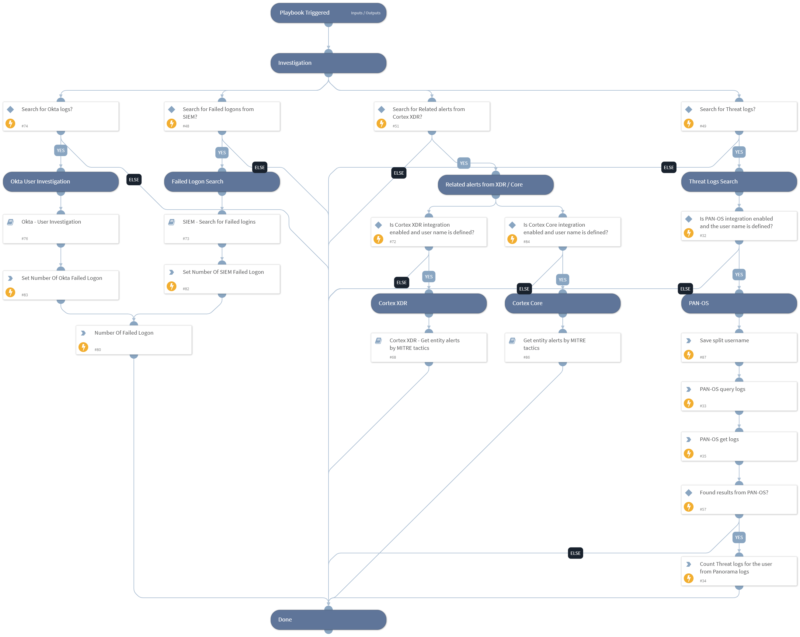

This playbook performs an investigation on a specific user, using queries and logs from SIEM, Identity management systems, XDR, and firewalls.

Supported Integrations:
-Okta
-Splunk
-QRadar
-Azure Log Analytics
-PAN-OS
-XDR / Core By Palo Alto Networks.

## Dependencies

This playbook uses the following sub-playbooks, integrations, and scripts.

### Sub-playbooks

* Get entity alerts by MITRE tactics
* Okta - User Investigation
* SIEM - Search for Failed logins
* Cortex XDR - Get entity alerts by MITRE tactics

### Integrations

This playbook does not use any integrations.

### Scripts

* Set
* CountArraySize
* SetAndHandleEmpty
* MathUtil

### Commands

* pan-os-query-logs
* pan-os-get-logs

## Playbook Inputs

---

| **Name** | **Description** | **Default Value** | **Required** |
| --- | --- | --- | --- |
| SplunkIndex | Splunk's index name in which to search. Default is "\*" - All. | * | Optional |
| SplunkEarliestTime | The earliest time for the Splunk search query. | -1d | Optional |
| SplunkLatestTime | The latest time for the Splunk search query. | now | Optional |
| UserEmail | The user email to search Okta logs. |  | Optional |
| Username | User name. |  | Optional |
| LoginCountry | The Country from which the user logged in. |  | Optional |
| SIEMFailedLogonSearch | Whether to search for failed logon logs from Siem? Can be False or True. | True | Optional |
| ThreatLogSearch | Whether to search for threat logs from PAN-OS? Can be False or True. | True | Optional |
| XDRAlertSearch | Whether to search for Related alerts from XDR? Can be False or True. | True | Optional |
| OktaSearch | Whether to search for logs from Okta? Can be False or True. | True | Optional |
| XDRUsernameField | Cortex XDR User name Field. | actor_effective_username | Optional |
| QRadarSearchTime | The Search Time for the QRadar search query. for example:  Last 1 days | Last 1 days | Optional |
| AzureSearchTime | The Search Time for the Azure Log Analytics search query. for example: ago\(1d\) | ago(1d) | Optional |
| ASN | The ASN from which the user logged in. |  | Optional |

## Playbook Outputs

---

| **Path** | **Description** | **Type** |
| --- | --- | --- |
| NumOfSiemFailedLogon | Number of failed login from Siem. | unknown |
| NumOfThreatLogs | Number of Threat Logs for the user from Panorama. | unknown |
| PaloAltoNetworksXDR.Alert | XDR Alerts. | unknown |
| ArraySize | Number of XDR alert for the user. | unknown |
| PermanentCountry | True if the user work from a permanent country from Okta. False if else. | unknown |
| UserDevices | Devices used by the user from Okta. | unknown |
| NumOfOktaSuspiciousActivities | Number of Suspicious Activities for the user from Okta. | unknown |
| SuspiciousUserActivities | Suspicious Activities for the user from Okta. | unknown |
| NumOfOktaSuspiciousUserAgent | Number of Suspicious User Agent from Okta. | unknown |
| SuspiciousUserAgent | Suspicious User Agent from Okta. | unknown |
| UserApplication |  Applications used by the user from Okta. | unknown |
| NumOfOktaFailedLogon | Number of failed login from Okta. | unknown |
| AzureFailedLogonLogs | The result of the Azure Log Analytics search. | unknown |
| QRadar.Search.Result | The result of the QRadar search. | unknown |
| Splunk.Result | The results of the Splunk search. The results are a JSON array, in which each item is a Splunk event. | unknown |
| NumOfFailedLogon | Number of failed login. | unknown |
| NumOfFailedLogonASN | Number of failed login from ASN by all users. | unknown |

## Playbook Image

---

