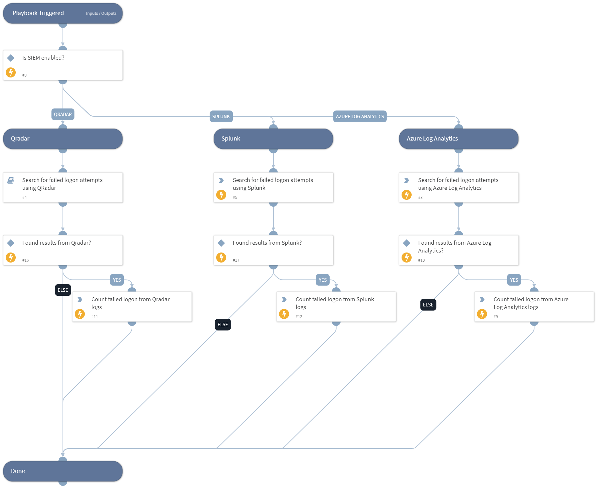

This playbook searches for failed logon on a specific user by querying logs from different sources.

Supported Integrations:
-Splunk
-QRadar
-Azure Log Analytics

## Dependencies
This playbook uses the following sub-playbooks, integrations, and scripts.

### Sub-playbooks
* QRadarFullSearch

### Integrations
This playbook does not use any integrations.

### Scripts
* CountArraySize

### Commands
* azure-log-analytics-execute-query
* splunk-search

## Playbook Inputs
---

| **Name** | **Description** | **Default Value** | **Required** |
| --- | --- | --- | --- |
| SplunkIndex | Splunk's index name in which to search. Default is "\*" - All. |  | Optional |
| SplunkEarliestTime | The earliest time for the Splunk search query. |  | Optional |
| SplunkLatestTime | The latest time for the Splunk search query. |  | Optional |
| Username | User name. |  | Optional |

## Playbook Outputs
---

| **Path** | **Description** | **Type** |
| --- | --- | --- |
| NumOfSiemFailedLogon | Number of failed login from Siem. | unknown |

## Playbook Image
---
