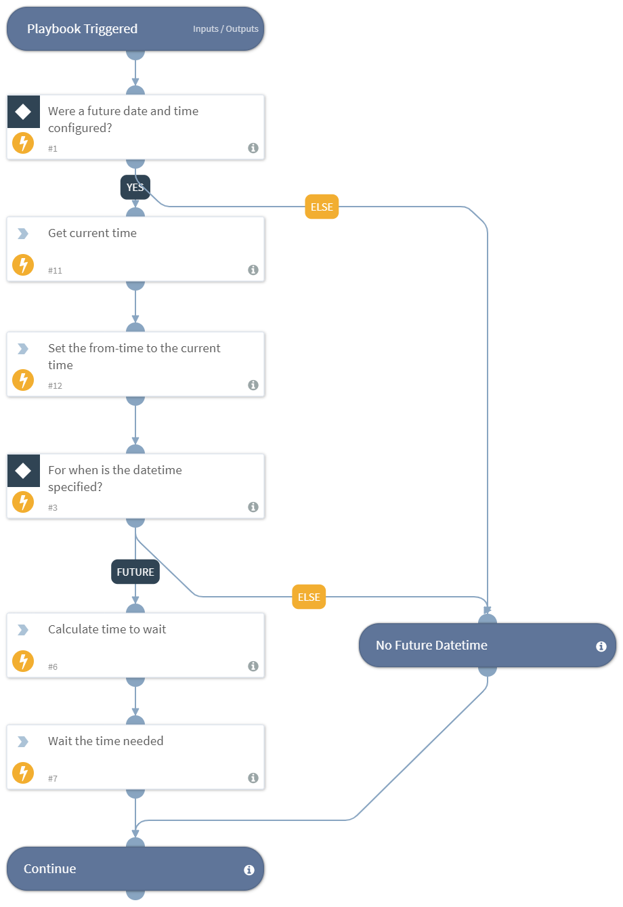

Pauses execution until the date and time that is specified in the plabyook input, is reached.

## Dependencies
This playbook uses the following sub-playbooks, integrations, and scripts.

### Sub-playbooks
This playbook does not use any sub-playbooks.

### Integrations
This playbook does not use any integrations.

### Scripts
* Sleep
* CalculateTimeDifference
* Set
* GetTime

### Commands
This playbook does not use any commands.

## Playbook Inputs
---

| **Name** | **Description** | **Required** |
| --- | --- | --- | 
| DatetimeToWaitUntil | The date and time to wait until before finishing the playbook. Should be in ISO-8601 format. For example, 2019-11-13T15:33:10.314406457Z | Required |

## Playbook Outputs
---
There are no outputs for this playbook.

## Playbook Image
---

