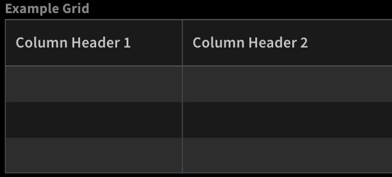
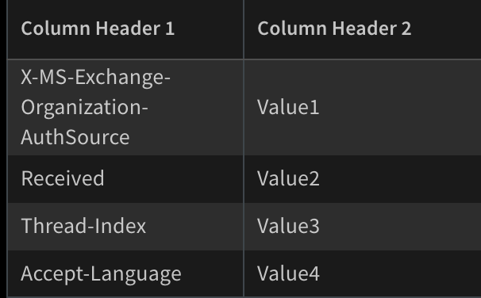
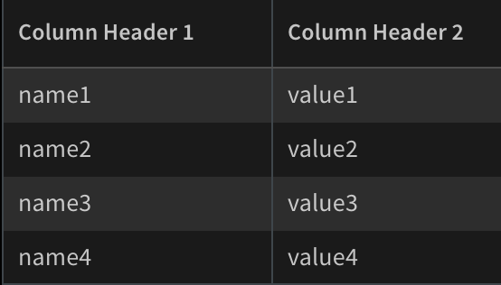
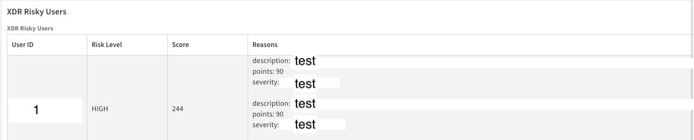
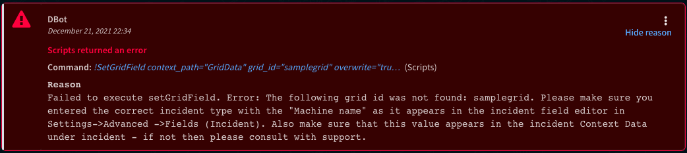

Update Grid Table from items or key value pairs.

## Script Data

---

| **Name** | **Description** |
| --- | --- |
| Script Type | python3 |
| Tags |  |
| XSOAR Version | 5.0.0 |

## Inputs

---

| **Argument Name** | **Description**                                                                                                                                                                                                                                                                                       |
| --- |-------------------------------------------------------------------------------------------------------------------------------------------------------------------------------------------------------------------------------------------------------------------------------------------------------|
| context_path | Context path to list of items with similar properties or key value pairs.                                                                                                                                                                                                                             |
| grid_id | Grid ID to modify. This argument can be either: 1) Grid name as it appears in the layout. 2) Grid "Machine name", as can be found in the grid incident field editor under Settings->Advanced->Fields (Incidents).                                                                                     |
| overwrite | True if to overwrite Grid Data, False otherwise.                                                                                                                                                                                                                                                      |
| columns | Comma-separated list of column header names, for example: columns="columnheader1,columnheader2,.."                                                                                                                                                                                  |
| keys | Keys to retrieve from items or &quot;\*&quot; for max keys \(limited when item list to columns amount\) \- Key will not be columns correlated. If you want to leave an empty column, provide a place holder name that should not be in the context data such as "PLACE_HOLDER"<br>Make sure the key is lower case and does not contain spaces. For example, for a column header named USER ID, key="userid".               |
| sort_by | Columns names by which to sort the rows.                                                                                                                                                                                                                                                              |
| unpack_nested_elements | Set to 'true' to unpack nested elements.                                                                                                                                                                                                                                                              |
| keys_from_nested | Keys to retrieve from nested dictionaries. Can be used only when the unpack_nested_elements argument is set to false. Keys will not be columns correlated. Default is all keys. **Note**: when the number of values exceeds the number of columns, it truncates the last values that are outside the range for table. |

## Command Example

Assume the following:

1. Entry Context:

```json
{
  "EWS": {
    "Items": {
      "HeadersMap": {
        "X-MS-Exchange-Organization-AuthSource": "Value1",
        "Received": "Value2",
        "Thread-Index": "Value3",
        "Accept-Language": "Value4"
      },
      "headers": [
        {
          "name": "name1",
          "value": "value1"
        },
        {
          "name": "name2",
          "value": "value2"
        },
        {
          "name": "name3",
          "value": "value3"
        },
        {
          "name": "name4",
          "value": "value4"
        }
      ]
    }
  }
}
```

2. Grid: \


Considering the following cases:

1. Key value to Grid:

```shell script
!SetGridField columns="columnheader1,columnheader2" context_path=EWS.Items.HeadersMap grid_id=mygrid 
keys="Received,Thread-Index,X-MS-Exchange-Organization-AuthSource,Accept-Language"
```

Grid after update: \

 
2. List of item properties to Grid:

```shell script
!SetGridField columns="columnheader1,columnheader2" context_path=EWS.Items.headers grid_id=mygrid 
keys="name, value"
```

Grid after update: \
 

Entry Context:

```json
{
    "PaloAltoNetworksXDR": {
        "RiskyUser": [
            {
                "email": null,
                "id": "1",
                "norm_risk_score": 1000,
                "reasons": [
                    {
                        "date created": "2023-08-20",
                        "description": "test",
                        "points": 90,
                        "severity": "test",
                        "status": "test"
                    },
                    {
                        "date created": "2023-08-20",
                        "description": "test",
                        "points": 90,
                        "severity": "test",
                        "status": "test"
                    }
                ],
                "risk_level": "HIGH",
                "score": 244,
                "type": "user"
            }
        ]
    }
}
```

```script
!SetGridField_CopyForInvestigation columns=`User id,Risk level,Score,Reasons` grid_id=xdrriskyusers context_path=`PaloAltoNetworksXDR.RiskyUser` keys=`id,risk_level,score,reasons` keys_from_nested=description,points,severity
```



## Troubleshooting

The first time you run `SetGridField` on a newly created grid field, you may see an error similar to the following:



To resolve the error:

1. Make sure the grid field is associated with the incident type the field is being used in.
2. Run the following command to initialize the grid field: `!setIncident <GRID_FIELD_NAME>=[]`


