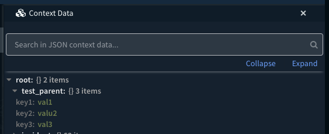

Sets multiple key/value pairs to the context under a common parent key. 

## Script Data

---

| **Name** | **Description** |
| --- | --- |
| Script Type | python |
| Tags | Utility |


## Inputs

---

| **Argument Name** | **Description** |
| --- | --- |
| parent | The parent key to which we append all the other keys. |
| keys | The comma-separated list of keys. |
| values | The comma-separated list of values. |

## Outputs

---
There are no outputs for this script.

## Example

---

### Command

```
!SetMultipleValues parent=test_parent keys=key1,key2,key3 values=val1,valu2,val3
```

### Context Result



