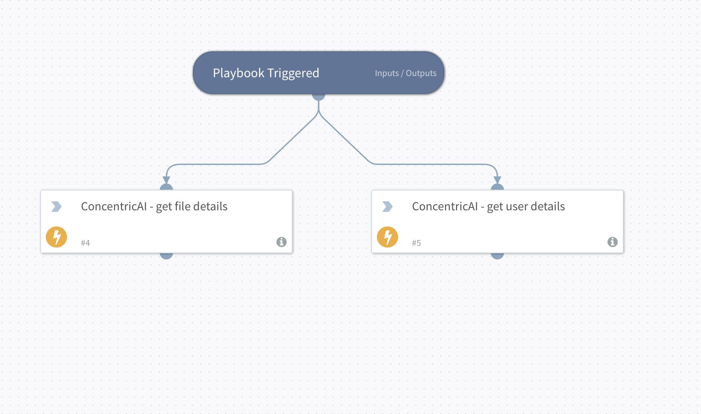

# ConcentricAI Demo Playbook

This playbook demonstrates how to handle a ConcentricAI risk incident. It fetches all relevant file details and user information for the owner of the flagged file.

## Dependencies

This playbook uses the following sub-playbooks, integrations, and scripts.

### Integrations

* ConcentricAI

### Commands

* `concentricai-get-file-details`
* `concentricai-get-user-details`
* `concentricai-get-file-sharing-details`

## Playbook Inputs

| **Name** | **Description** | **Default Value** | **Required** |
| --- | --- | --- | --- |
| File Name | File name to check. | `incident.filename` | Required |
| Path Name | The path of the file. | `incident.filepath` | Required |
| User Name | The username (local part of the email) of the file owner. | `incident.agentid` | Optional |

## Playbook Outputs

There are no outputs for this playbook.

## Playbook Image

