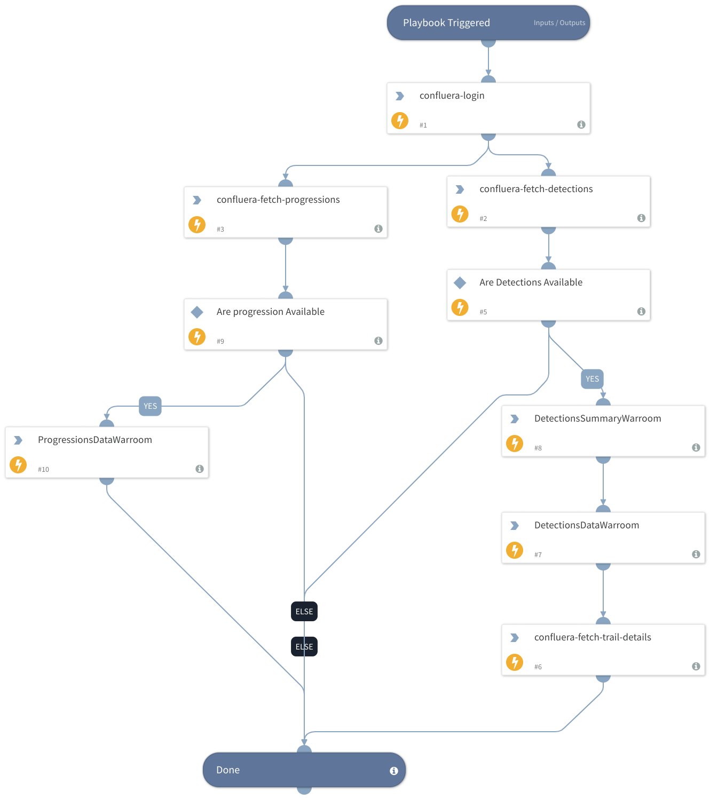

This playbook simulates data fetching process from Confluera's IQ-Hub portal, using "Confluera" integration.

## Dependencies
This playbook uses the following integrations, and scripts.

### Sub-playbooks
This playbook does not use any sub-playbooks.

### Integrations
* Confluera

### Commands
* confluera-fetch-progressions
* confluera-fetch-detections
* confluera-fetch-trial-details

## Playbook Inputs
---

There are no inputs for this playbook.

## Playbook Outputs
---
There are no outputs for this playbook.

