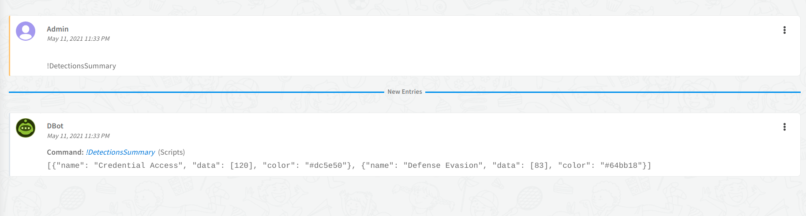

# ConflueraDetectionsSummary Script

### Script Data
---

| **Name** | **Description** |
| --- | --- |
| Script Type | python3 |
| Tags | Confluera |
| Cortex XSOAR Version | 6.0.0 |

### Inputs
---
| **Argument Name** | **Description** |
| --- | --- |
| N/A | N/A |

### Outputs
---
| **Path** | **Description** | **Type** |
| --- | --- | --- |
| N/A | N/A | N/A |


### Script Example
---
```!ConflueraDetectionsSummary```

### Human Readable Output
---
