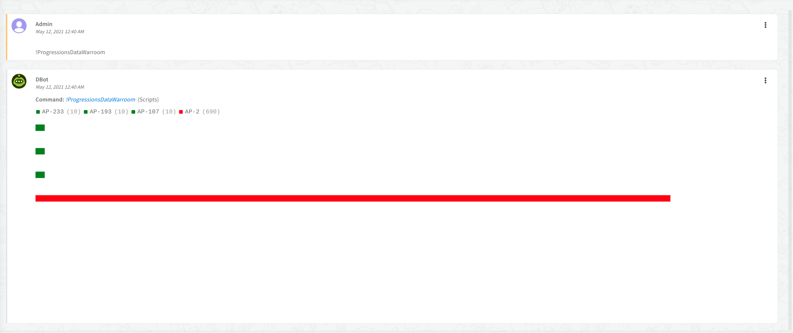

# ProgressionsDataWarroom Script

<br>

### Script Data
---
| **Name** | **Description** |
| --- | --- |
| Script Type | python3 |
| Tags | Confluera |
| Demisto Version | 6.0.2 |

<br>

### Inputs
---

| **Argument Name** | **Description** |
| --- | --- |
| N/A | N/A |

<br>

### Outputs
---

| **Path** | **Description** | **Type** |
| --- | --- | --- |
| N/A | N/A | N/A |

<br>

### Script Example
---
```!ProgressionsDataWarroom```

<br>

### Human Readable Output
---



