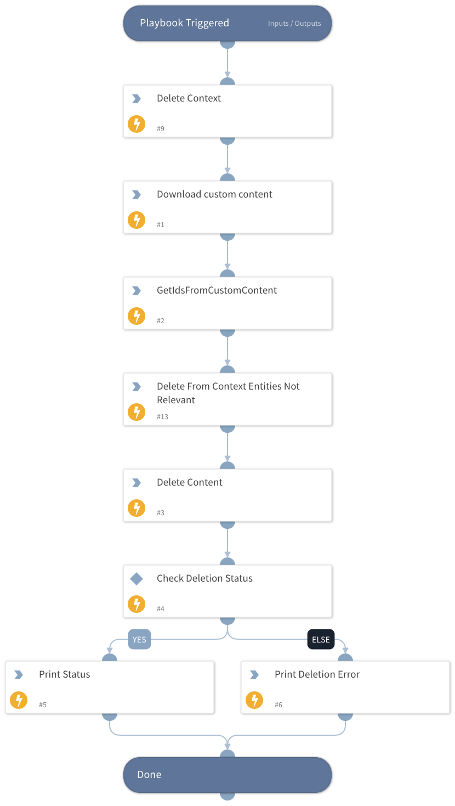

This playbook deletes custom content from the system. It deletes Playbooks, Scripts, Layouts, Classifiers, Mappers, Incident Types and Incident Fields.

## Dependencies

This playbook uses the following sub-playbooks, integrations, and scripts.

### Sub-playbooks

This playbook does not use any sub-playbooks.

### Integrations

This playbook does not use any integrations.

### Scripts

* DeleteContent
* DeleteContext
* PrintErrorEntry
* Print
* GetIdsFromCustomContent

### Commands

core-api-download

## Playbook Inputs

---

| **Name** | **Description** | **Default Value** | **Required** |
| --- | --- | --- | --- |
| dry_run | If true, will not actually delete any content entities. | true | Required |
| instance_name | Core REST API instance name to use. |  | Optional |

## Playbook Outputs

---
There are no outputs for this playbook.

## Playbook Image

---

