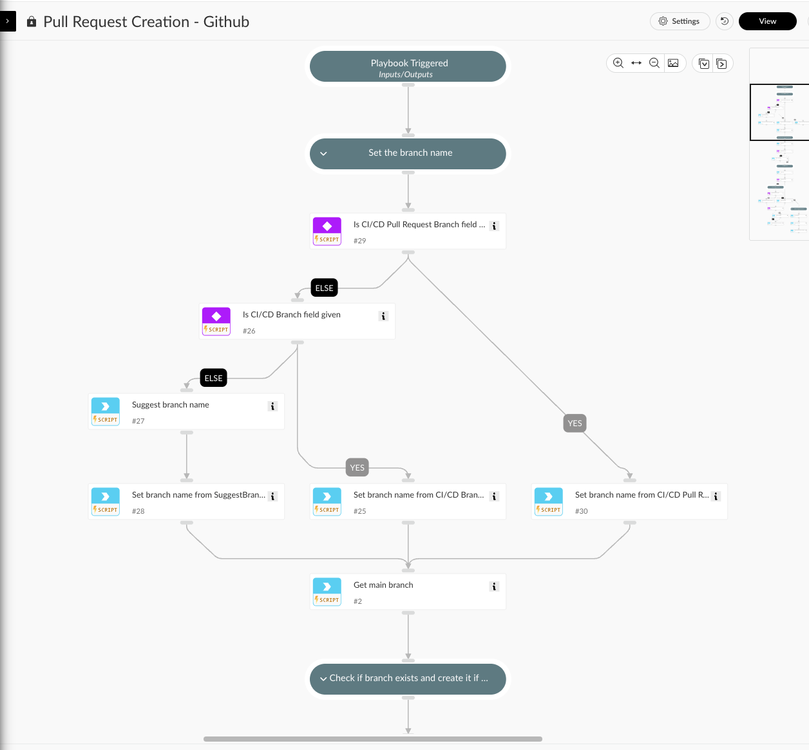

This playbook creates a pull request using Github integration.

## Dependencies
This playbook uses the following sub-playbooks, integrations, and scripts.

### Sub-playbooks
This playbook does not use any sub-playbooks.

### Integrations
This playbook does not use any integrations.

### Scripts
* CommitFiles
* Set
* SuggestBranchName

### Commands
* GitHub-request-review
* GitHub-create-branch
* GitHub-get-branch
* GitHub-create-pull-request
* GitHub-list-branch-pull-requests

## Playbook Inputs
---

| **Name** | **Description** | **Default Value** | **Required** |
| --- | --- | --- | --- |
| PullRequestTemplate | Pull request description template. |  | Required |
| MainBranch | The name of the branch you want the changes pulled into, which must be an existing branch on the current repository. |  | Required |

## Playbook Outputs
---
There are no outputs for this playbook.

## Playbook Image
---
