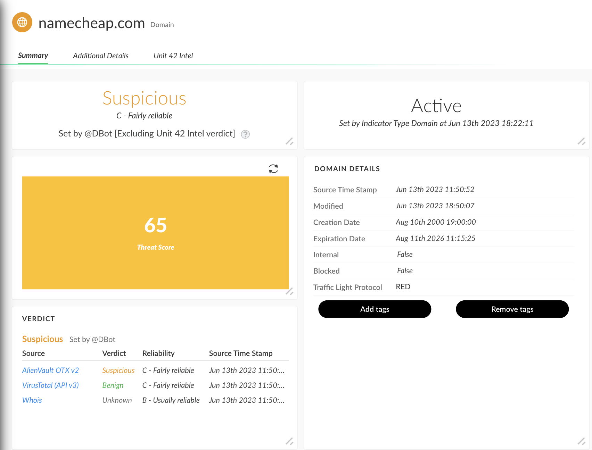

This pack lets you calculate custom threat scores for indicators of compromise (IOC(s)).

In Cortex XSOAR, an indicator’s verdict is assigned according to the verdict returned by the source with the highest reliability. For more information, check our documentation on [Indicator Verdict](https://docs-cortex.paloaltonetworks.com/r/Cortex-XSOAR/6.5/Cortex-XSOAR-Threat-Intel-Management-Guide/Indicator-Verdict).

To increase the efficacy of the threat data collected across multiple sources, we need to look at more parameters beyond an indicator’s verdict. For example, it is common knowledge that signatures like IP addresses and hashes are not used by an attacker long after being discovered. So, we could use an indicator’s age and de-prioritize indicators that are older.

#### Design

In this version, the custom scores are derived from certain pre-defined factors in a list.
1. Factor values can be of different types.
	1. Continuous: Values of a factor can be in a range, like *relatedIncidentCount*. This is true for factors that have a numerical format.
	2. Discrete: Values of a factor can be discrete and mapped to individual keys. For example, *geocountry* value can be *US*.
2. Factor values can be obtained from an indicator in different ways.
	1. Derived: It can be derived from a field. For example, *age* can be calculated from indicator field *firstSeen*. There are custom calculations required for derived factors, and so these cannot be added dynamically to the list of factors. The derived factors are:
		1. *age*: An indicator’s age is calculated as the time difference between *now* and when the indicator was first seen.
		2. *weightedScore*: An indicator’s weighted score is calculated as by taking each source’s reliability as weight and associated verdict as value.
			$$weightedScore = \frac{\sum_{i=0}^{N}{{source\_reliability}^2_i.score_i}}{\sum_{i=0}^{N}{source\_reliability_i}}$$
	1. Directly extracted: It can be extracted from an existing field. For example, *geocountry* can be extracted from an existing indicator field directly.

#### Results
Finally, the indicator is assigned a threat score between 0-100. The ThreatScoreWidget can be added to the layout to display the indicator score.

#### Recommendations
Here is a sample JSON list. Please stick to the exact format for accurate results.

{
    "geocountry": {
        "alias": "admincountry",
        "weight": 1,
        "type": "discrete",
        "derived": false,
        "search_related": "domain",
        "factor_scores": {
            "us": 90,
            "ru": 60,
            "cn": 60,
            "gb": 10,
            "default": 100
        }
    },
    "organization": {
        "alias": "adminname",
        "weight": 1,
        "type": "discrete",
        "derived": false,
        "search_related": "domain",
        "factor_scores": {
            "akamai": 0,
            "cloudflare": 0,
            "digitalocean-64-227-0-0": 0,
            "google": 50,
            "google llc": 50,
            "default": 100
        }
    },
    "weightedScore": {
        "alias": "",
        "weight": 4,
        "type": "continuous",
        "derived": true,
        "search_related": "",
        "factor_scores": {}
    },
    "age": {
        "alias": "",
        "weight": 1,
        "type": "continuous",
        "derived": true,
        "search_related": "",
        "factor_scores": {
            "0": 100,
            "7": 80,
            "14": 70,
            "21": 60
        }
    },
    "indicator_type": {
        "alias": "",
        "weight": 3,
        "type": "discrete",
        "derived": false,
        "search_related": "",
        "factor_scores": {
            "ip": 50,
            "domain": 70,
            "url": 90,
            "file": 100,
            "default": 100
        }
    },
    "relatedIncCount": {
        "alias": "",
        "weight": 1,
        "type": "continuous",
        "derived": false,
        "search_related": "",
        "factor_scores":{
            "10": 100,
            "5": 80,
            "3": 70,
            "0": 60
        }
    }
}
