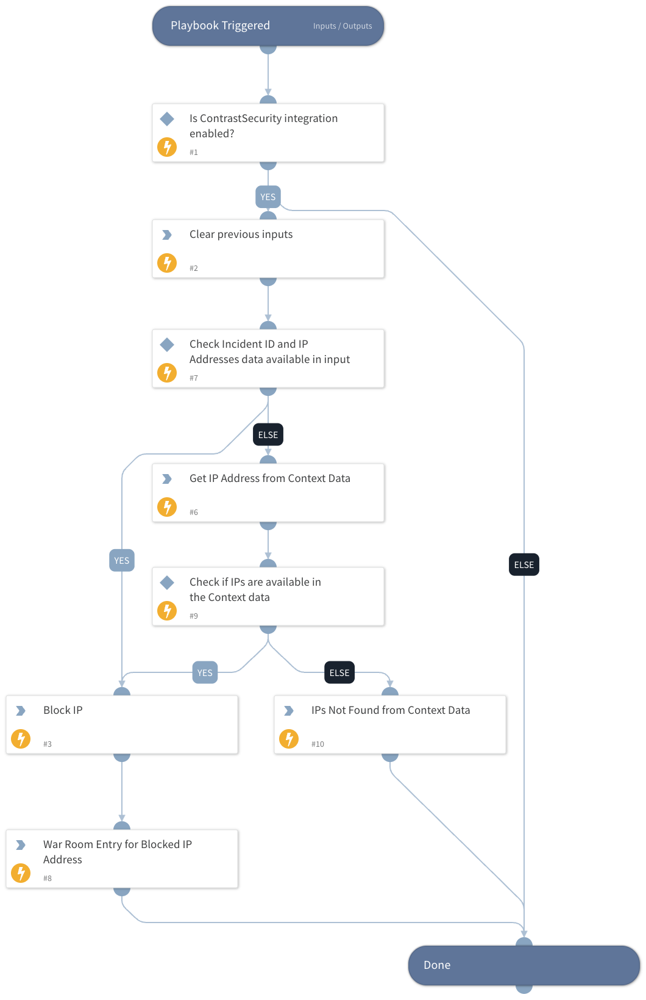

This playbook blocks IP addresses related to a Contrast Security incident based on the provided expiration time.

## Dependencies

This playbook uses the following sub-playbooks, integrations, and scripts.

### Sub-playbooks

This playbook does not use any sub-playbooks.

### Integrations

This playbook does not use any integrations.

### Scripts

* DeleteContext
* Print
* SetAndHandleEmpty

### Commands

* contrastsecurity-ip-block

## Playbook Inputs

---

| **Name** | **Description** | **Default Value** | **Required** |
| --- | --- | --- | --- |
| ip_addresses | Provide IP address to block. Supports comma-separated values. |  | Optional |
| incident_id | Specify the ID of the Incident. |  | Optional |
| expiration_date | Specify the IP address expiration duration time. If no expiration date is provided, the IP addresses will be blocked for Forever. |  | Optional |

## Playbook Outputs

---
There are no outputs for this playbook.

## Playbook Image

---

