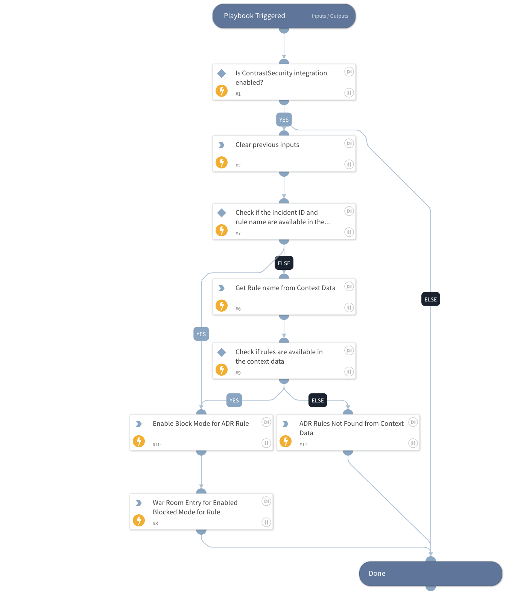

This playbook enables block mode for a specific ADR rule associated with a Contrast Security incident.

## Dependencies

This playbook uses the following sub-playbooks, integrations, and scripts.

### Sub-playbooks

This playbook does not use any sub-playbooks.

### Integrations

This playbook does not use any integrations.

### Scripts

* DeleteContext
* Print
* SetAndHandleEmpty

### Commands

* contrastsecurity-adrpolicy-update

## Playbook Inputs

---

| **Name** | **Description** | **Default Value** | **Required** |
| --- | --- | --- | --- |
| rule_names | Specify the ADR rule name to configure. Supports comma-separated values. |  | Optional |
| incident_id | Specify the ID of the Incident.  |  | Optional |
| dev_mode | Specify the Blocking mode for the Development environment. Possible values are: Off, Monitor, Block, Block at perimeter. | Monitor | Optional |
| qa_mode | Specify the Blocking mode for the QA environment. Possible values are: Off, Monitor, Block, Block at perimeter. | Monitor | Optional |
| prod_mode | Specify the Blocking mode for the Production environment. Possible values are: Off, Monitor, Block, Block at perimeter. | Monitor | Optional |

## Playbook Outputs

---
There are no outputs for this playbook.

## Playbook Image

---

