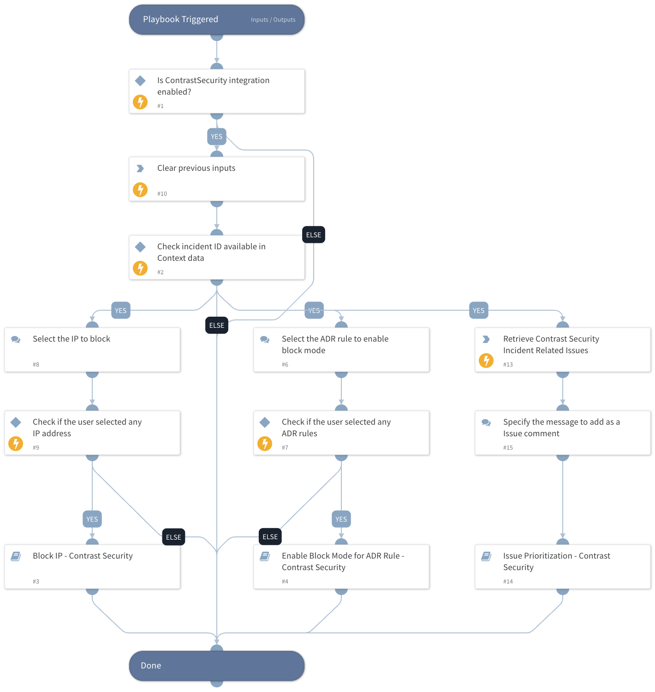

This master playbook handles all incident-related use cases by blocking source IPs and enabling the selected blocking mode for the specified ADR rules.

## Dependencies

This playbook uses the following sub-playbooks, integrations, and scripts.

### Sub-playbooks

* Block IP - Contrast Security
* Enable Block Mode for ADR Rule - Contrast Security
* Issue Prioritization - Contrast Security

### Integrations

This playbook does not use any integrations.

### Scripts

* ContrastSecurityDisplayIncidentIssues
* DeleteContext

### Commands

This playbook does not use any commands.

## Playbook Inputs

---
There are no inputs for this playbook.

## Playbook Outputs

---
There are no outputs for this playbook.

## Playbook Image

---

