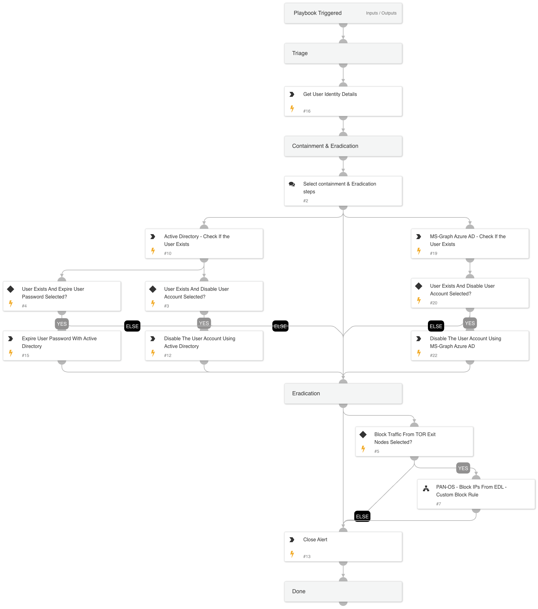

This playbook is designed to handle the following alert:

- A successful login from TOR

The playbook executes the following stages:

Triage:

- The playbook will fetch the user identity details.

Remediation & Eradication:

- The playbooks will suggest several actions for the analyst to take: disabling the user account using Active Directory or Azure Active Directory, expiring the user password using Active Directory, or blocking traffic from TOR exit nodes using PAN-OS and Palo Alto Networks' predefined EDL.

The analyst can select multiple actions, which will then be executed by the playbook based on the analyst's choices.

Requirements: 
For any response action, you will need one of the following integrations: Azure Active Directory Users / Active Directory Users.

## Dependencies

This playbook uses the following sub-playbooks, integrations, and scripts.

### Sub-playbooks

* PAN-OS - Block IPs From EDL - Custom Block Rule

### Integrations

* Cortex Core - IR

### Scripts

This playbook does not use any scripts.

### Commands

* ad-disable-account
* ad-expire-password
* ad-get-user
* closeInvestigation
* core-get-cloud-original-alerts
* msgraph-user-account-disable
* msgraph-user-list

## Playbook Inputs

---
There are no inputs for this playbook.

## Playbook Outputs

---
There are no outputs for this playbook.

## Playbook Image

---

