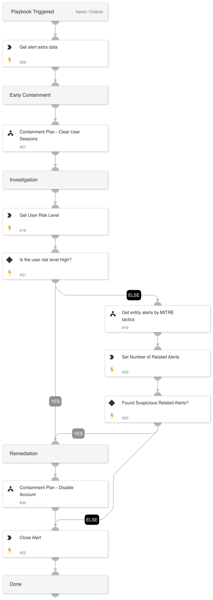

This playbook is designed to handle the following alerts:
- A successful SSO sign-in from TOR
- A successful SSO sign-in from TOR via a mobile device

The playbook executes the following stages:

Early Containment:
- Clear/revoke the user sessions and force re-authentication.

Investigation:
- Checks the user's risk score.
- Checks for suspicious user agent usage within the alert.
- Checks for related XDR alerts using MITRE tactics to identify any malicious activity.

Remediation:
- Based on the user's risk score and related alerts, the playbook will disable the account if any malicious parameters are found. By default, account disabling requires analyst approval.

Requires: 
Integrations - Microsoft Graph User / Okta v2.

## Dependencies

This playbook uses the following sub-playbooks, integrations, and scripts.

### Sub-playbooks

* Block Account - Generic v2
* Containment Plan - Clear User Sessions

### Integrations

* CortexCoreIR

### Scripts

* SearchAlertsV2

### Commands

* core-get-cloud-original-alerts
* closeInvestigation
* core-list-risky-users

## Playbook Inputs

---

| **Name** | **Description** | **Default Value** | **Required** |
| --- | --- | --- | --- |
| UserVerification | Specify if analyst verification is required to disable user accounts. Possible values:True/False. Default:True. | True | Optional |

## Playbook Outputs

---
There are no outputs for this playbook.

## Playbook Image

---

